# Multi-robot Kinodynamic Motion Planning: Fast, Real-world

```{=html}
<video data-autoplay loop muted playsinline src="media/video/icaps/icaps-gif.mp4" width="100%"></video>
```

# Multi-robot Coordination 

Discrete vs. Continuous Motion Planning

::: {.container}
:::: {.col .element: class="fragment" data-fragment-index="1"}
::: {.box-white}
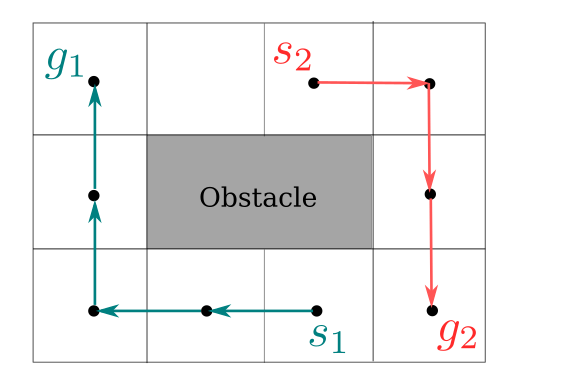
:::
- Discrete time steps
- Grid representation of the world
::::

:::: {.col .element: class="fragment" data-fragment-index="2"}
::: {.box-white}
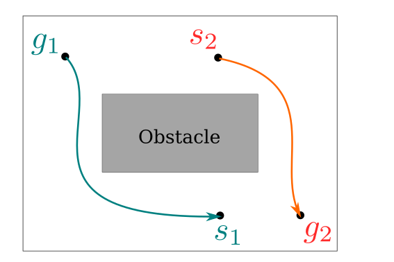
:::
- Continuous state & time
- Infinite possible motions
::::

:::

# Multi-robot Coordination 

Discrete vs. Continuous Motion Planning

::: {.container}

:::: {.col}
::: {.box-white}
```{=html}
<video data-autoplay loop muted playsinline src="media/video/icaps/mapf-example.mp4" width="100%"></video>
```
:::
::::

:::: {.col}
::: {.box-white}
```{=html}
<video data-autoplay loop muted playsinline src="media/video/icaps/mrmp-example.mp4" width="100%"></video>
```
:::
::::

:::

::: {.container}

:::: {.col}
- <span style="color:green"><b>Fast</b></span>
- <span style="color:green"><b>Scale well</b></span> with >1000 agents
- Output can be <span style="color:red"><b>infeasible</b></span> for real robots
::::

:::: {.col}
- Reason about <span style="color:green"><b>robot dynamics</b></span>
- <span style="color:red"><b>Slow</b></span>
- <span style="color:red"><b>Scale poorly</b></span> beyond a few robots
::::

:::


# Bridging MAPF and Kinodynamic Motion Planning

db-LaCAM: *fast*, *scalable*, *dynamics-aware* motion planner for multi-robot systems.

. . . 

- Supports arbitrary robot dynamics

. . . 

- Up to 10x faster compared to SOTA kinodynamic motion planners

. . . 

- Resolution-complete w.r.t motion primitives.

# db-LaCAM: Main Idea

db-LaCAM is built upon *two* core ideas: 

::: {.container}

:::: {.col .element: class="fragment"}
::: {.box-def}
:::: {.box-def-title}

Discontinuity-bounded Search
::::
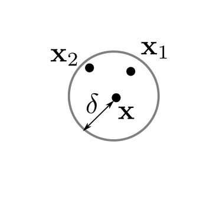{width=300}

allows $\delta$ between states

:::
::::

:::: {.col .element: class="fragment"}
::: {.box-def}
:::: {.box-def-title}

LaCAM algorithm
::::
{ width=450}

Search-based graph pathfinder
:::
::::

:::

# db-LaCAM: Approach

Extending LaCAM to the continuous domain is non-trivial.

. . . 

::: {.box-def}
:::: {.box-def-title}
Challenges
::::

- Continuous state space
- Constraints from robot dynamics
- Harder heuristic estimation - Euclidean distance fails.
:::


# db-LaCAM: Approach 

db-LaCAM uses db-PIBT for *fixed-length horizon trajectory* planning using motion primitives

{width=600}

which follows robot dynamics $\mathbf{x}_{k+1} = \mathbf{f}(\mathbf{x}_k,\mathbf{u}_k)$


# db-LaCAM: Approach

Planning fixed-length horizon motions

::: {.box-def}

::: {.r-stack}

:::{.element: class="fragment current-visible"}
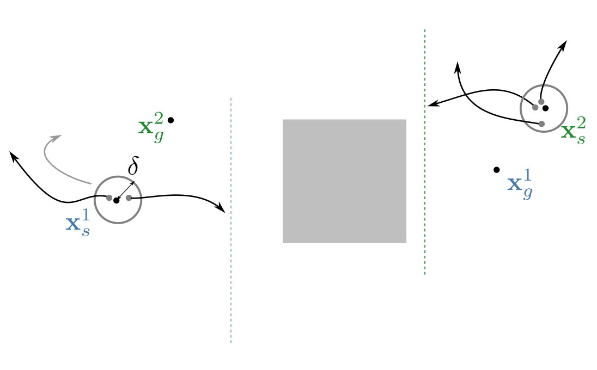{width=600}

Step 1: find applicable motions
::::
:::{.element: class="fragment current-visible"}
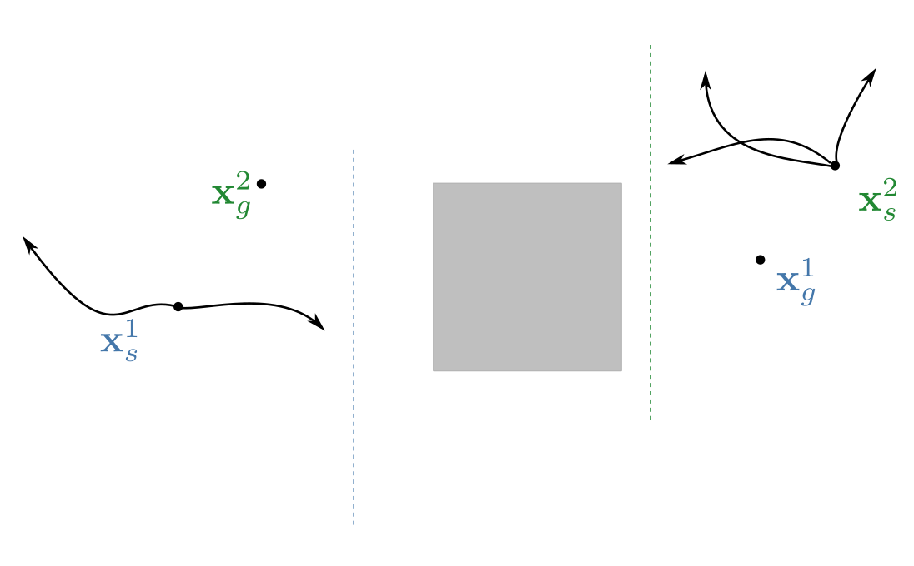{width=600}

Step 2: rollout applicable motions

::::
:::{.element: class="fragment current-visible"}
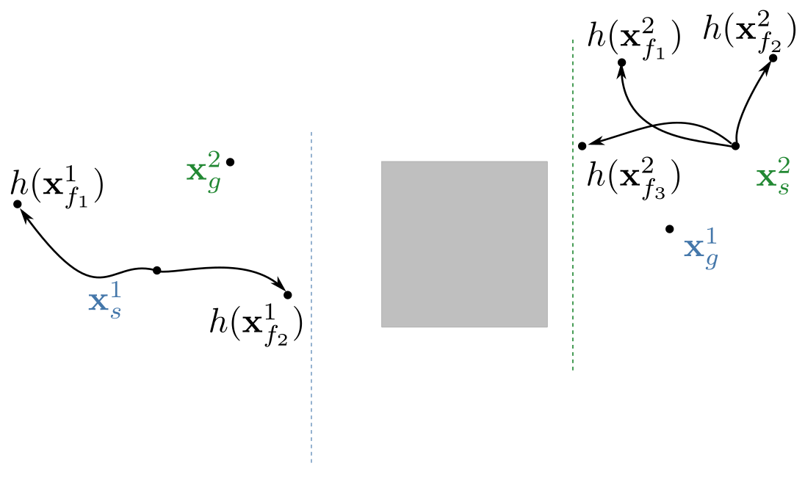{width=600}

Step 3: compute cost-to-go (h)

:::: 
:::{.element: class="fragment current-visible"}
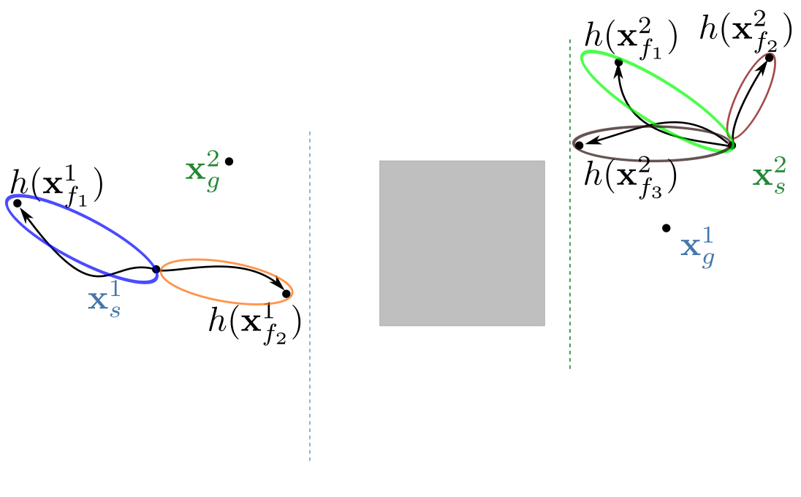{width=600}

Step 4: sort motions based on h-value and cluster

::::
:::{.element: class="fragment current-visible"}
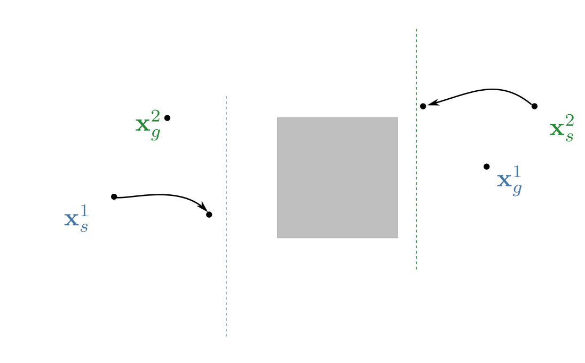{width=600}

Pick the *best* motions for each robot

::::
:::{.element: class="fragment current-visible"}
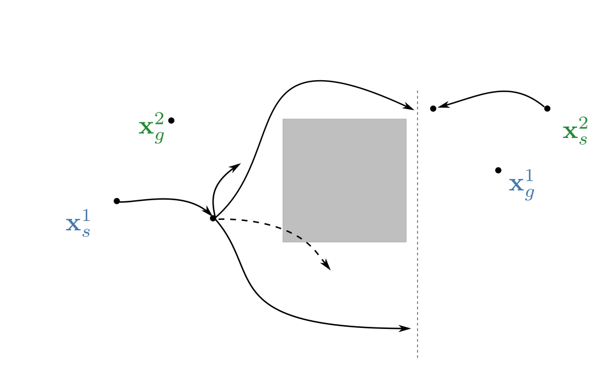{width=600}

Rollout motions for the Robot 1 for the next horizon

::::
:::{.element: class="fragment current-visible"}
{width=600}

Rollout motions for the Robot 2 for the next horizon

::::
:::{.element: class="fragment current-visible"}
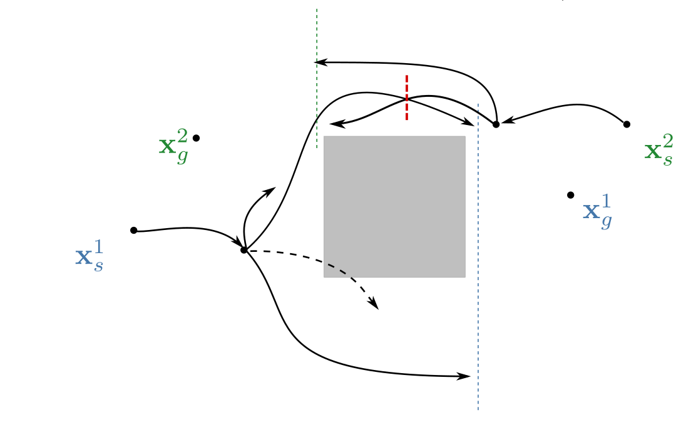{width=600}

Potential collision between robots - *Priority Inheritance*

::::
:::{.element: class="fragment current-visible"}
{width=600}

With priority inheritance Robot 2 plans its trajectory

::::
:::{.element: class="fragment current-visible"}
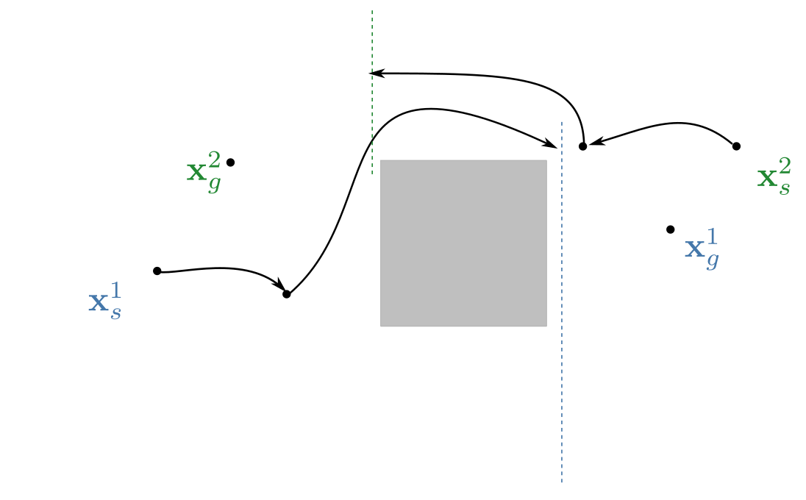{width=600}

Once Robot 2 has plan, Robot 1 reserves its motion

::::
:::{.element: class="fragment current-visible"}
{width=600}

Continue planning until all robots reach their goal states.

::::
:::
:::

# db-LaCAM: Approach 

Example search process using the motion primitives employed in this work

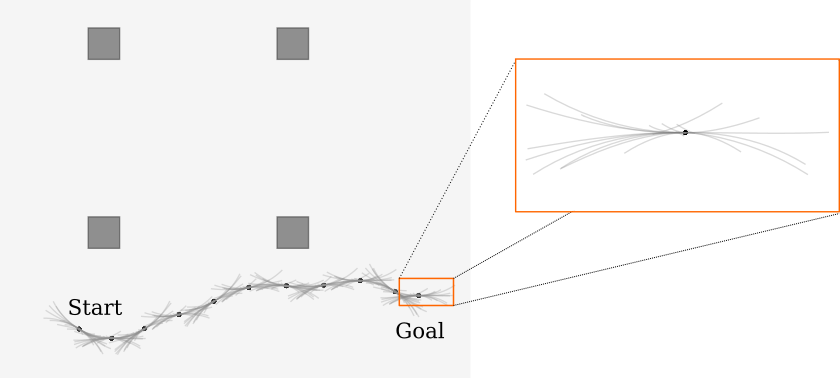{width=800}


# db-LACAM: Heuristic Estimation with Hierarchical EST
::: {.r-stack}
:::{.element: class="fragment current-visible" data-fragment-index="1"}
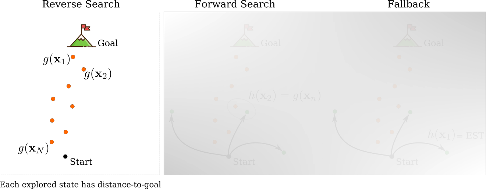
::::
:::{.element: class="fragment current-visible" data-fragment-index="2"}
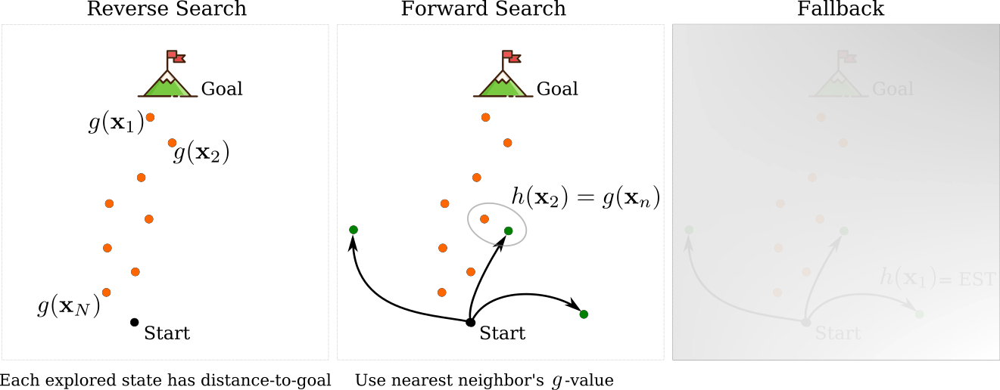
::::
:::{.element: class="fragment current-visible" data-fragment-index="3"}
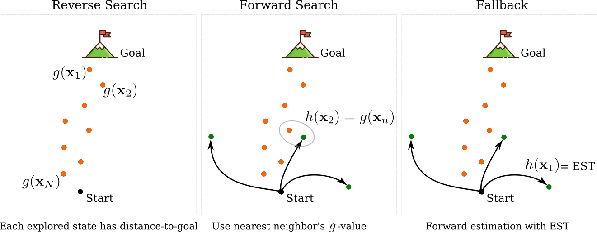
::::
:::{.element: class="fragment current-visible" data-fragment-index="4"}
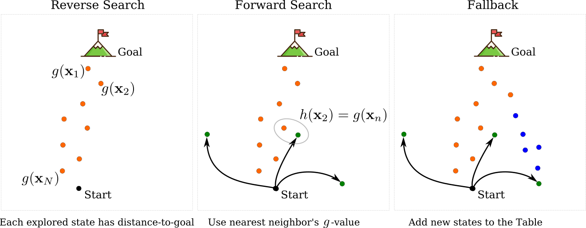
::::
:::


# db-LaCAM: Experimental Results

- Heterogeneous team
- Dynamics: unicycle ($1^{(st)}$ order), flying robots (double integrator 3D)

```{=html}
<video data-autoplay loop muted playsinline src="media/video/icaps/hetero_new4x.mp4" width="140%"></video>
```

# db-LaCAM: Experimental Results

- Maze example with 10 robots
- Dynamics: unicycle ($1^{(st)}$ order)

```{=html}
<video data-autoplay loop muted playsinline src="media/video/nu/dblacam-maze.mp4" width="100%"></video>
```

# db-LaCAM: Experimental Results

- Random example with 50 robots
- Dynamics: unicycle ($1^{(st)}$ order)

```{=html}
<video data-autoplay loop muted playsinline src="media/video/nu/dblacam-n50.mp4" width="100%"></video>
```

# db-LaCAM: Experimental Results

- Forest example with 10 robots
- Dynamics: flying robots (double integrator 3D)

```{=html}
<video data-autoplay loop muted playsinline src="media/video/nu/dblacam-forest.mp4" width="100%"></video>
```
# db-LaCAM: Deployment on Real Robots
- Video 1: flying robots (double integrator 3D) - Sanity drones
- Video 2: car with trailer - Polulu 3pi+ 2040 with a trailer attached to it

```{=html}
<video data-autoplay loop muted playsinline src="media/video/aaai/dblacam.mp4" width="100%"></video>
```

# Conclusion and Limitations

We introduced db-LaCAM, a kinodynamic multi-robot motion planner that: 

. . . 

- Supports *arbitrary* robot dynamics

. . . 

- Up to *10x faster runtime* compared to SOTA planners

. . . 

- Is *resolution complete* w.r.t motion primitives.


. . . 

Limitations: 

- Expensive heuristic estimation


# Time for Questions!

{width=300}

