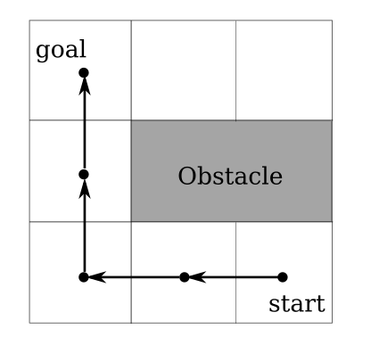
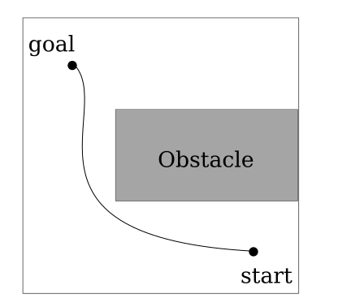

# Multi-robot Kinodynamic Motion Planning: Fast, Real-world

```{=html}
<video data-autoplay src="media/video/aaai/dblacam.mp4" width="100%"></video>
```

# Introduction: Multi-robot Coordination 

Discrete vs. Continuous Planning

::: {.container}
:::: {.col .element: class="fragment" data-fragment-index="1"}
::: {.box-white}

:::
- Discrete time steps
- Grid representation of the world
::::

:::: {.col .element: class="fragment" data-fragment-index="2"}
::: {.box-white}

:::
- Continuous state & time
- Infinite possible motions
::::

:::

# Introduction: Multi-robot Coordination 

Discrete vs. Continuous Planning

::: {.container}
:::: {.col .element}
::: {.box-white}
```{=html}
<video data-autoplay src="media/video/aaai/swap1_trailer_grid.mp4" width="100%"></video>
```
:::
::::

:::: {.col .element}
::: {.box-white}
```{=html}
<video data-autoplay src="media/video/aaai/swap1_trailer.mp4" width="100%"></video>
```
:::
::::

:::

# Existing Planners

# Main Idea

# Core of our planner

# MAPF to MRMP

# Background 

# Approach 

# Experiments 

# Experiments: Scalaility

# Experiments: Livelock Detection

# Conclusion and Limitations

