# 


```{=html}
<video data-autoplay loop muted playsinline src="media/video/icaps/icaps-gif.mp4" width="100%"></video>
```
. . .

- Goal: Coordinate a team of robots, while respecting *robot dynamics*

. . . 

- Contribution: A novel multi-robot *kinodynamic* motion planner which is <span style="color:green"><b>fast, scalable</b></span>.

<!-- Multi-robot *kinodynamic* motion planning: <span style="color:green"><b>fast, real-world platforms</b></span> -->

# Background: Robot Dynamics

<!-- ::: {.box-def}
:::: {.box-blue-title}
Dynamics
::::
A function that describes the change of the configuration space, given the current configuration and control.
:::

. . . -->

::: {.box-green}
:::: {.box-green-title}
Car with trailer Dynamics
::::
States $\mathbf{x} = (x, y, \theta_1, \theta_2)$, where $x,y$ is the position, and $\theta_1$, $\theta_2$ are the orientations for the car and trailer. Actions $\mathbf{u} = (v, \phi)$, where $v$ is linear velocity, $\phi$ the steerig angle. 
$L$ is the car wheelbase, $L_h$ is the hitch length.
The dynamics $\mathbf{\dot{x} = \mathbf{f}(\mathbf{x}, \mathbf{u})}$ are:

$\dot{x} = v \cos \theta_1, \quad \dot{y} = v \sin \theta_1, \quad \dot{\theta_1} = \frac{v}{L}\tan \phi$,  $\quad \dot{\theta_2} = \frac{v}{L_h} \sin (\theta_1 - \theta_2)$

:::

{width=400}

. . .

Motion planning now considers *how* to move, not just where.

# Background: Multi-robot Coordination 

Discrete vs. Continuous

::: {.container}
:::: {.col .element: class="fragment" data-fragment-index="1"}
::: {.box-white}
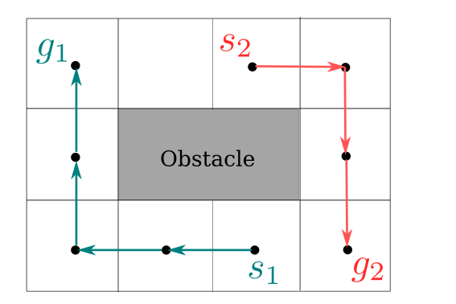
:::
- Discrete time steps
- Grid representation of the world
::::

:::: {.col .element: class="fragment" data-fragment-index="2"}
::: {.box-white}
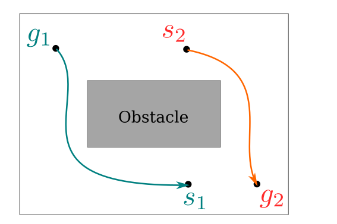
:::
- Continuous state & time
- Infinite possible motions
::::

:::

# Background: Multi-robot Coordination 

Discrete vs. Continuous

::: {.container}

:::: {.col}
::: {.box-white}
```{=html}
<video data-autoplay loop muted playsinline src="media/video/icaps/mapf-example.mp4" width="100%"></video>
```
:::
::::

:::: {.col}
::: {.box-white}
```{=html}
<video data-autoplay loop muted playsinline src="media/video/icaps/mrmp-example.mp4" width="100%"></video>
```
:::
::::

:::

::: {.container}

:::: {.col}
- <span style="color:green"><b>Fast</b></span>
- <span style="color:green"><b>Scale well</b></span> with >1000 agents
- Output can be <span style="color:red"><b>infeasible</b></span> for real robots
::::

:::: {.col}
- Reason about <span style="color:green"><b>robot dynamics</b></span>
- <span style="color:red"><b>Slow</b></span>
- <span style="color:red"><b>Scale poorly</b></span> beyond few robots
::::

:::

. . . 

Combine <span style="color:green"><b>strengths</b></span> of both methods.


# Contribution

db-LaCAM: *fast*, *scalable*, *dynamics-aware* motion planner for multi-robot systems, which:

. . . 

- supports arbitrary robot dynamics

. . . 

- up to 10x faster compared to SOTA kinodynamic motion planners

. . . 

- holds theoretical properties (resolution completeness).

# db-LaCAM: Approach

db-LaCAM is built upon *two* core ideas: 

::: {.container}

:::: {.col .element: class="fragment"}
::: {.box-def}
:::: {.box-def-title}

Discontinuity-bounded Search (W.Hönig, 2022)
::::
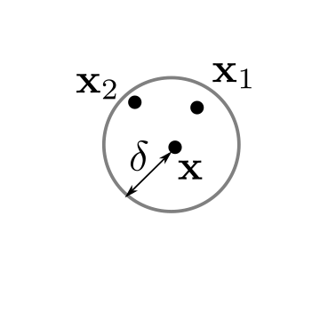{width=300}

Allows $\delta$ between states ( $\mathbf{x}$ &rarr; $\mathbf{x_1}$)

:::
::::

:::: {.col .element: class="fragment"}
::: {.box-def}
:::: {.box-def-title}

LaCAM algorithm (K.Okumura, 2023)
::::
{ width=450}

Search-based graph pathfinder
:::
::::

:::

# db-LaCAM: Approach

Extending LaCAM to the continuous domain is non-trivial:

. . . 

- Continuous state space

. . .

- Constraints from robot dynamics

. . .

- Harder heuristic estimation - Euclidean distance fails
<!-- ::: {.box-def}
:::: {.box-def-title}
Challenges
::::

- Continuous state space
- Constraints from robot dynamics
- Harder heuristic estimation - Euclidean distance fails.
::: -->


# db-LaCAM: Approach 

db-LaCAM uses db-PIBT for *fixed-length horizon trajectory* planning using motion primitives

{width=600}

which follows robot dynamics $\mathbf{x}_{k+1} = \mathbf{f}(\mathbf{x}_k,\mathbf{u}_k)$


# db-LaCAM: Approach

Planning fixed-length horizon motions

::: {.box-def}

::: {.r-stack}

:::{.element: class="fragment current-visible"}
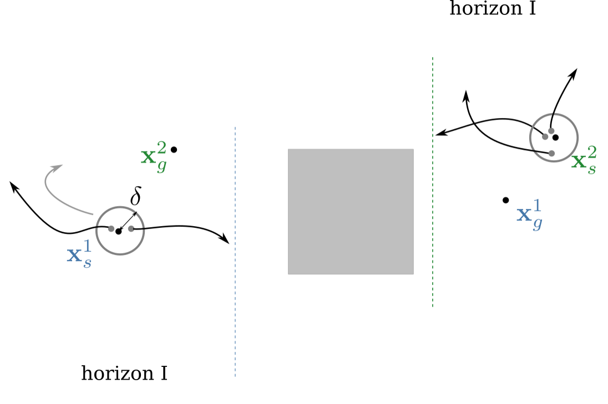{width=700}

Step 1: find applicable motions
::::
:::{.element: class="fragment current-visible"}
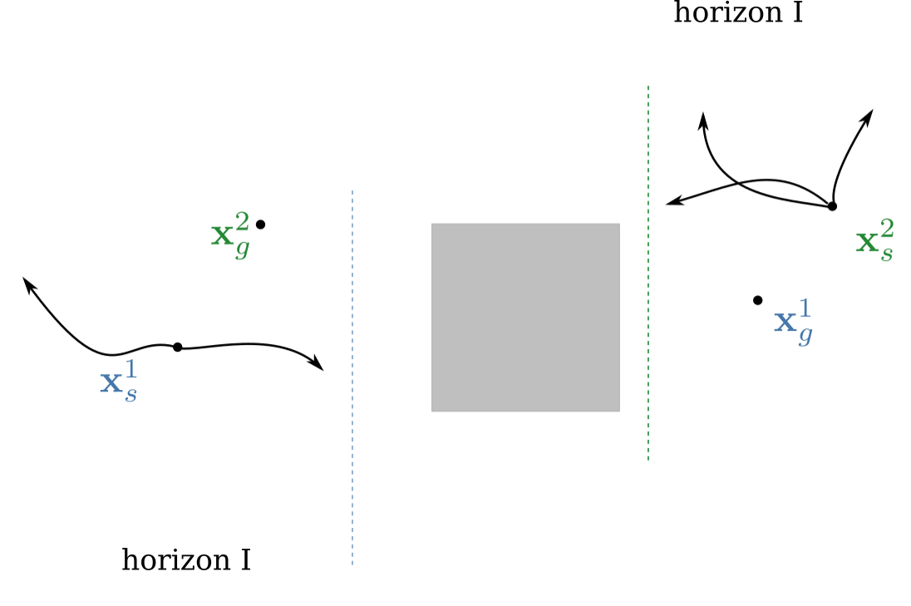{width=700}

Step 2: rollout applicable motions

::::
:::{.element: class="fragment current-visible"}
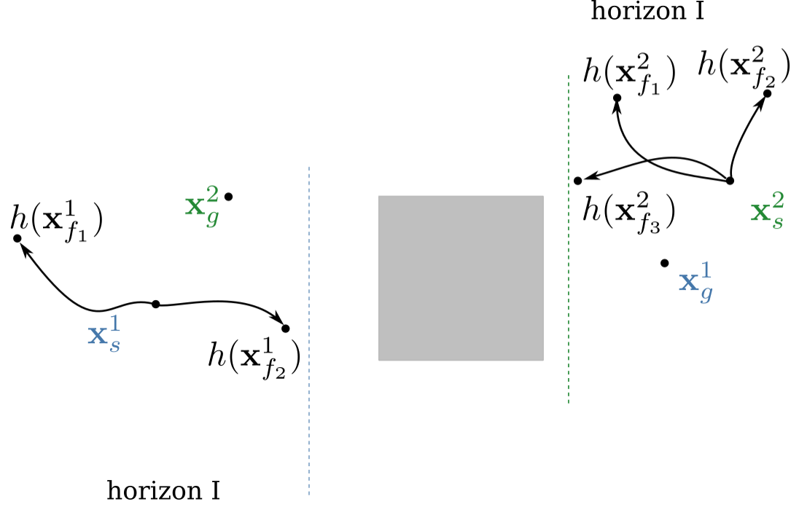{width=700}

Step 3: compute cost-to-go (h)

:::: 
:::{.element: class="fragment current-visible"}
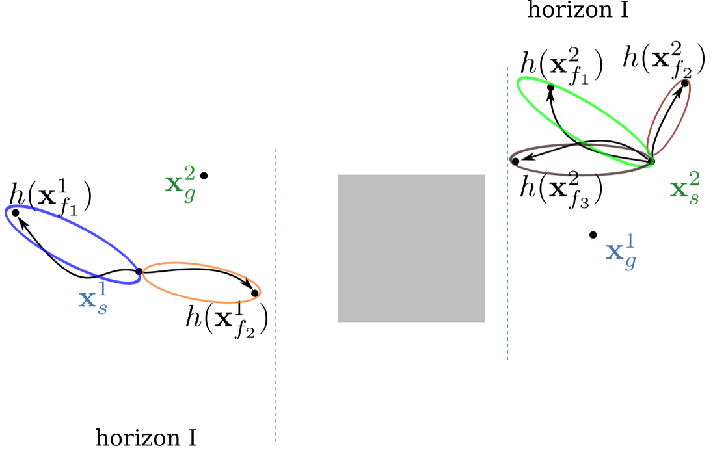{width=700}

Step 4: sort motions based on h-value and cluster

::::
:::{.element: class="fragment current-visible"}
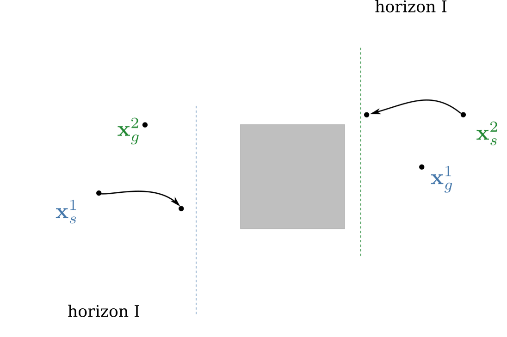{width=700}

Pick the *best* motions for each robot

::::
:::{.element: class="fragment current-visible"}
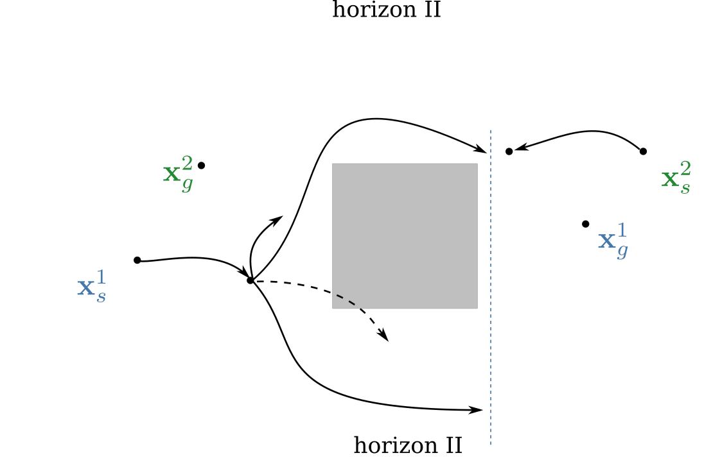{width=700}

Rollout motions for the Robot 1 for the next horizon

::::
:::{.element: class="fragment current-visible"}
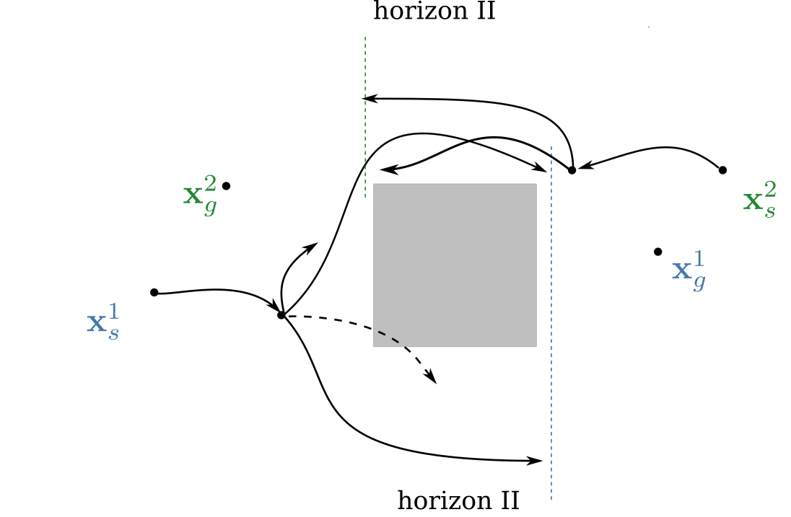{width=700}

Rollout motions for the Robot 2 for the next horizon

::::
:::{.element: class="fragment current-visible"}
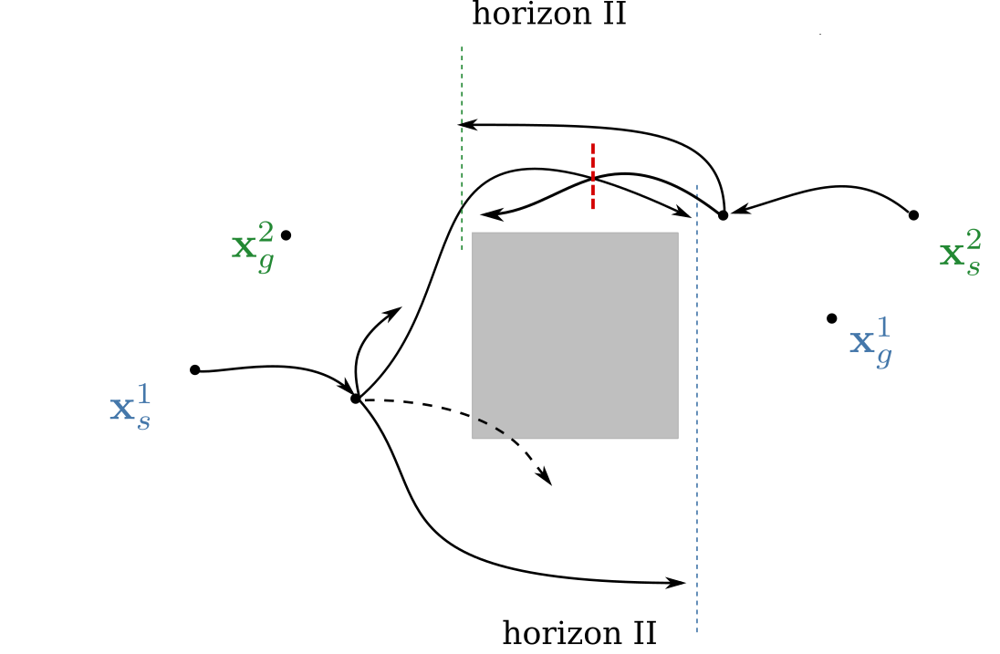{width=700}

Potential collision between robots - *Priority Inheritance*

::::
:::{.element: class="fragment current-visible"}
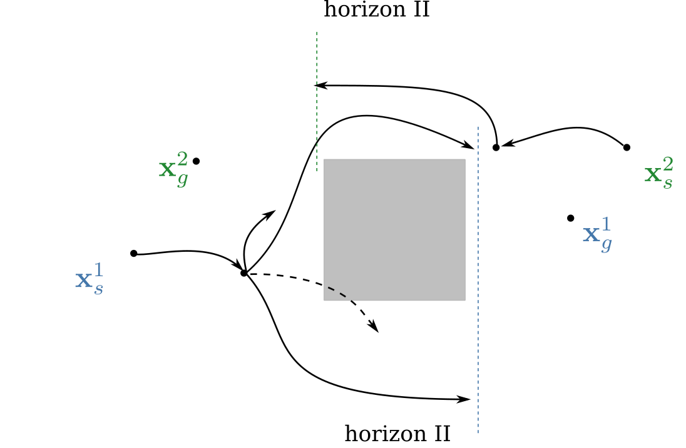{width=700}

With priority inheritance Robot 2 plans its trajectory

::::
:::{.element: class="fragment current-visible"}
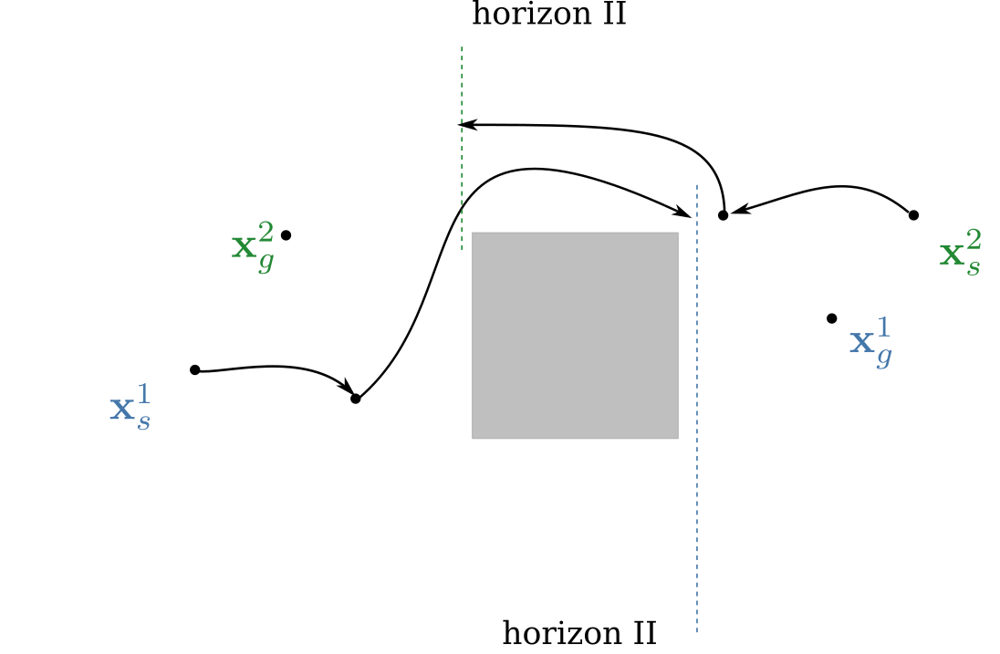{width=700}

Once Robot 2 has plan, Robot 1 reserves its motion

::::
:::{.element: class="fragment current-visible"}
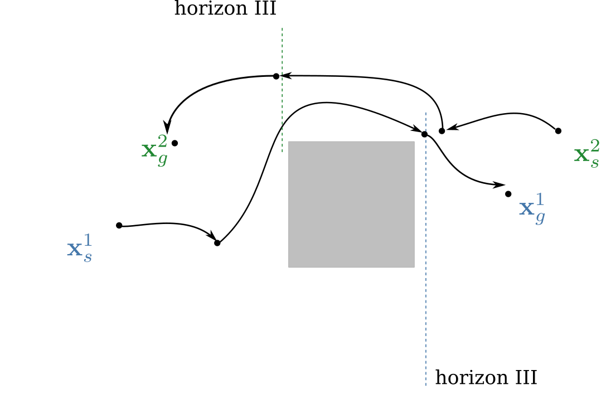{width=700}

Continue planning until all robots reach their goal states.

::::
:::
:::

# db-LaCAM: Approach 

Example search process using the motion primitives employed in this work

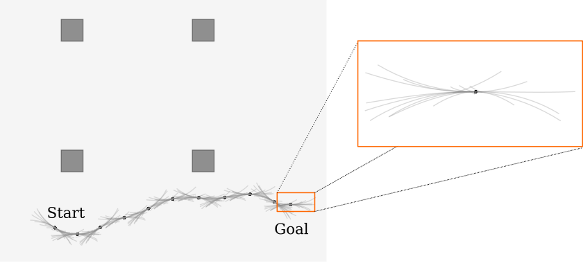{width=800}

# How is the search *guided* in kinodynamic settings?

# db-LACAM: Heuristic Estimation with Hierarchical EST
::: {.r-stack}
:::{.element: class="fragment current-visible" data-fragment-index="1"}
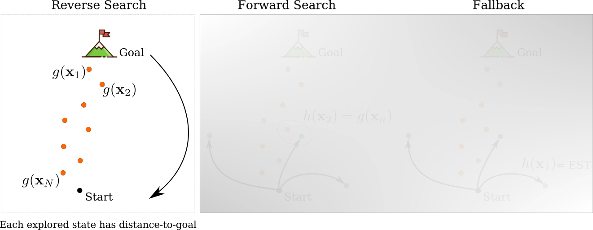
::::
:::{.element: class="fragment current-visible" data-fragment-index="2"}
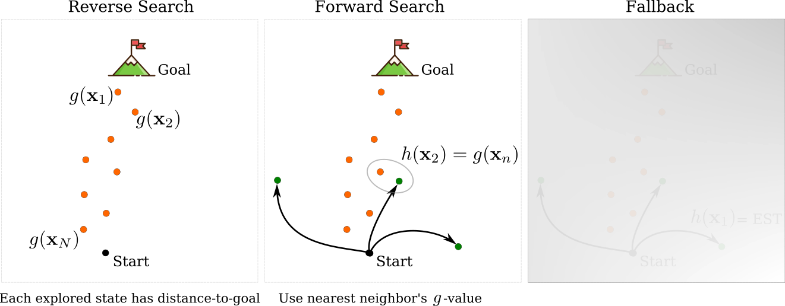
::::
:::{.element: class="fragment current-visible" data-fragment-index="3"}
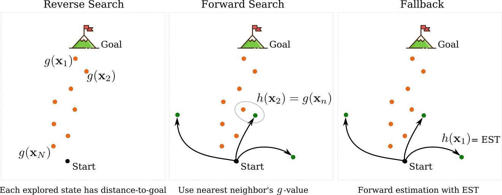
::::
:::{.element: class="fragment current-visible" data-fragment-index="4"}
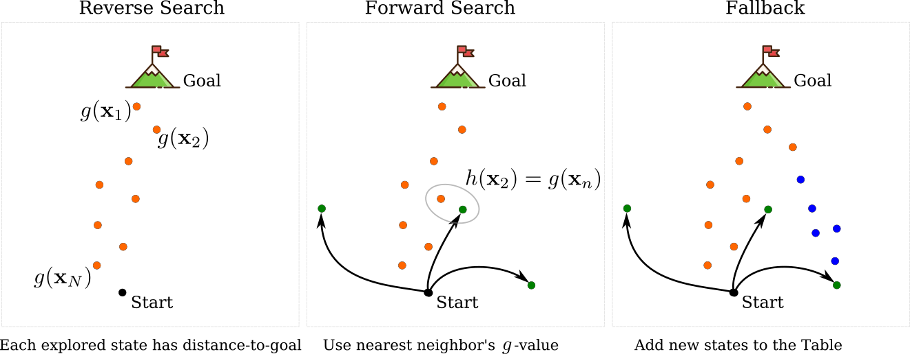
::::
:::


<!-- # db-LACAM: Heuristic Estimation with Hierarchical EST

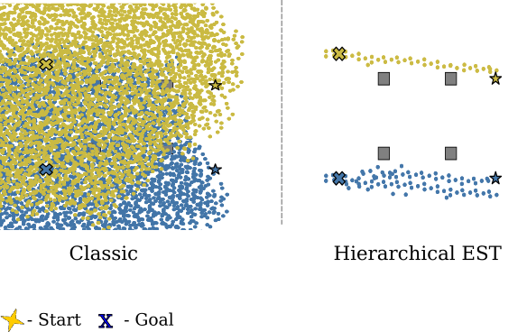{width=600} -->

# db-LaCAM: Overall Performance

- Dynamics: unicycle ($1^{(st)}$ order), flying robots (double integrator 3D), car with trailer
- Baselines: db-CBS (A.Moldagalieva, 2024), db-ECBS (A.Moldagalieva, 2025)

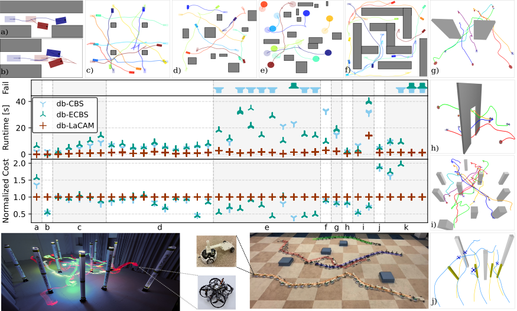

# db-LaCAM: Experimental Results

- Heterogeneous team
- Dynamics: unicycle ($1^{(st)}$ order), flying robots (double integrator 3D)

```{=html}
<video data-autoplay loop muted playsinline src="media/video/icaps/hetero_new4x.mp4" width="140%"></video>
```

# db-LaCAM: Experimental Results

- Maze example with 10 robots
- Dynamics: unicycle ($1^{(st)}$ order)

```{=html}
<video data-autoplay loop muted playsinline src="media/video/nu/dblacam-maze.mp4" width="100%"></video>
```

# db-LaCAM: Experimental Results

- Random example with 50 robots
- Dynamics: unicycle ($1^{(st)}$ order)

```{=html}
<video data-autoplay loop muted playsinline src="media/video/nu/dblacam-n50.mp4" width="100%"></video>
```

<!-- # db-LaCAM: Experimental Results

- Forest example with 10 robots
- Dynamics: flying robots (double integrator 3D)

```{=html}
<video data-autoplay loop muted playsinline src="media/video/nu/dblacam-forest.mp4" width="100%"></video>
``` -->
# db-LaCAM: Deployment on Real Robots
- Video 1: flying robots (double integrator 3D) - Sanity drones
- Video 2: car with trailer - Polulu 3pi+ 2040 with a trailer attached to it

```{=html}
<video data-autoplay loop muted playsinline src="media/video/aaai/dblacam.mp4" width="100%"></video>
```

# Summary

We introduced db-LaCAM, a kinodynamic multi-robot motion planner that: 

. . . 

- Supports *arbitrary* robot dynamics

. . . 

- Up to *10x faster runtime* compared to SoTA kinodynamic planners

. . . 

- Is *resolution complete* w.r.t motion primitives.

. . . 

Take Away : Kinodynamic multi-robot motion planner that is efficient (all dynamics), theoretically grounded remains an *open* challenge.


<!-- . . . 

- solution quality 

. . . 

- weaker theoretical properties

. . .  -->


# Thank you for your attention!

{width=300}

code: https://github.com/IMRCLab/db-lacam

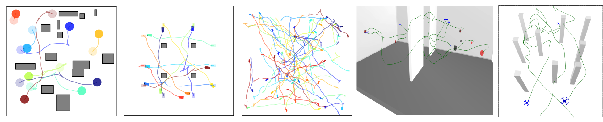

