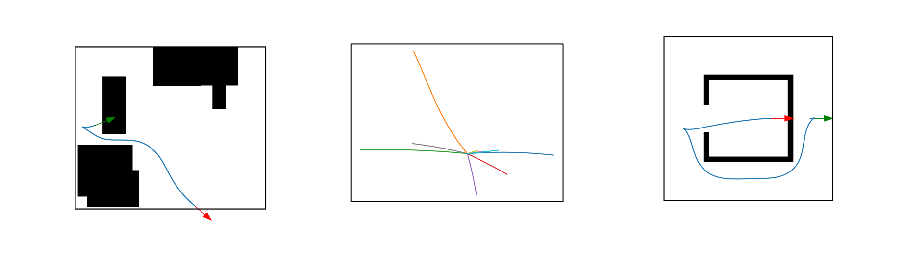
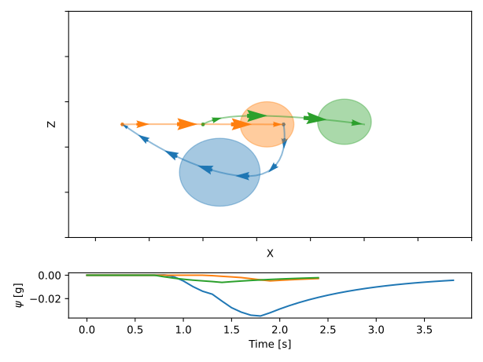

## db-CBS: Discontinuity-Bounded Conflict-Based Search for Multi-Robot Kinodynamic Motion Planning

[@moldagalieva2024]

## db-CBS
::: fragment
- heterogeneous team of robots (different dynamics, actuation limits)
:::
::: fragment
- leverages the MAPF solver CBS [@cbs], single robot kinodynamic motion planner, db-A* [@dbastar]
:::
::: fragment
- anytime, probabilistically complete, asymptotically optimal.
:::


## db-CBS

Step 1: All single robot trajectories are generated with db-A*

```{=html}
<video data-autoplay src="media/video/db-cbs-step1.mp4"></video>
```

## db-CBS 

Step 2: Inter-robot collisions are detected and resolved one-by-one

```{=html}
<video data-autoplay src="media/video/db-cbs-step2.mp4"></video>
```

## db-CBS 

Step 3: Discontinuities in robot trajectories are fixed with non-linear optimization

```{=html}
<video data-autoplay src="media/video/db-cbs-opt.mp4"></video>
```

## db-CBS - Anytime

Add more primitives, lower the discontinuity

```{=html}
<video data-autoplay src="media/video/db-cbs-anytime.mp4"></video>
```

## db-CBS - Results

Canonical Example - Alcove

```{=html}
<video data-autoplay src="media/video/db-cbs-alcove.m4v"></video>
```
- dynamics: unicycle

## db-CBS - Results

Canonical Example - At Goal

```{=html}
<video data-autoplay src="media/video/db-cbs-atgoal.m4v"></video>
```

- dynamics: unicycle

<!-- ## db-CBS - Results

Heterogeneous robots

```{=html}
<video data-autoplay src="media/video/db-cbs-scalability.m4v"></video>
``` -->

## db-CBS - Results

Only db-CBS solves these problems

```{=html}
<video data-autoplay src="media/video/db-cbs-only.mp4"></video>
```
- dynamics: car with trailer, unicycle ($1^{st}, 2^{nd}$-order), double integrator

## Limitations of db-CBS

::: {.container}

:::: {.col .element}
::::: {.box-def}
 - motion primitives used in the low-level search (db-A*) are environment-specific
:::::
::::
:::
- success rate drops with N $\geq$ 8 (time limit = 5min.)
- ignores aerodynamic interaction force between robots.


## Accelerating db-A* for Kinodynamic Motion Planning Using Diffusion
[@franke2025]<br>
<!-- <small>Submitted to IROS 2025</small> -->

## Generate motion primitives using Diffusion models

::: fragment
- conditioning on the problem instance characteristics (density, width, height)
:::
::: fragment
- test with robot dynamics like unicycle ($1^{st}, 2^{nd}$-order), car with trailer
:::
::: fragment
- reduction of the planning duration and solution cost up to $30\%$.
:::

## Generate motion primitives using Diffusion models




- left: random instance with solution (red: start, green: goal)
- middle: ten sampled motion primitives
- right: bugtrap problem instance with found solution.

## Limitations of db-CBS

 - motion primitives used in the low-level search (db-A*) are environment-specific

:::: {.col .element}
::::: {.box-def}
 - success rate drops with N $\geq$ 8 (time limit = 5min.)
 - ignores aerodynamic interaction force between robots.
:::::
::::


## Aerodynamic interaction force

```{=html}
<video data-autoplay src="media/video/downwash.mp4"></video>
```

## Interaction-Aware Multi-Robot Kinodynamic Motion Planning
<small>A.Moldagalieva, J.Ortiz-Haro, W.Hönig</small><br>
<small>Submitted to T-RO, March 2025</small>

## db-ECBS
<!-- (Submitted to T-RO) -->

::: fragment
- Reasons about *aerodynamic interaction* force between flying robots - Neural Network (NN) integration
:::
::: fragment
- Scales better with increasing number of robots (N=16) - ECBS
:::
::: fragment
- Better/faster implementation of the algorithm.
::: 


## db-ECBS: Close-proximity flight scene

<!-- - baseline: planner from NeuralSwarm2 - fails -->
- environment: 2x0.4x1 m.
- blue - small robots, orange - large robot

```{=html}
<video data-autoplay src="media/video/NeuralSwarm2-example.mp4"></video>
```
## db-ECBS: Close-proximity flight scene

<!-- - environment: 2x2x1 m.
- blue - small robots, orange - large robot -->
<!-- - Time for the first solution = 0.30s. -->



## db-ECBS: Close-proximity flight scene

- environment: 4x2x2 m.
- window size: 0.5x0.5 m.
<!-- - baseline: db-ECBS with conservative ellipsoid shape - 4/10 success rate -->

```{=html}
<video data-autoplay src="media/video/demo-uav.mp4"></video>
```

## db-ECBS: Heterogeneous robots

- environment: 3x2.4x1 m.

```{=html}
<video data-autoplay src="media/video/demo-hetero.mp4"></video>
```

## Limitations of db-ECBS

::: fragment
- computational burden - expensive collision checking
:::
::: fragment
- trajectory optimization in the joint state space of all robots - slow.
:::

## References

::: {#refs}
:::

# Perception for Downwash prediction

## Use free yaw-angle rotation

```{=html}
<video data-autoplay src="media/video/cvmrs-motivation.mp4"></video>
```
