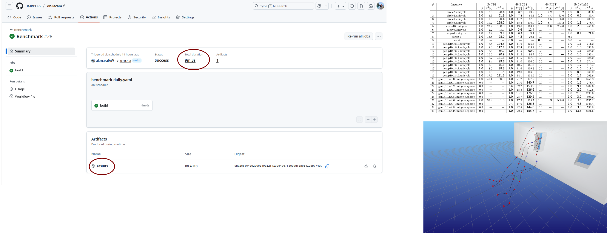
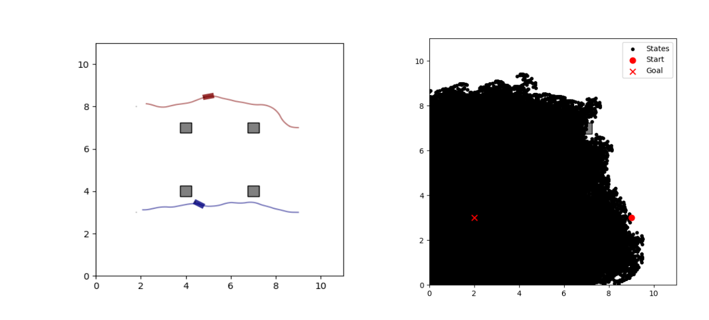
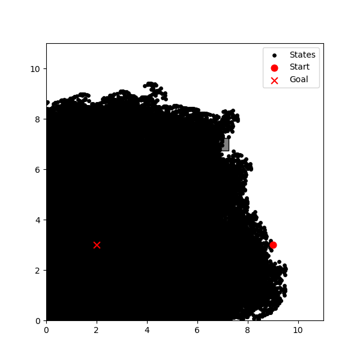

## Overview

- 3D dynamics with db-lacam
- Benchmarking setup
- Profiling - time statistics 
- Improve the computation time of db-lacam
- Comparison with baselines (2D, 3D)
- Next milestones.

## 3D dynamics with db-lacam

- double integrator 3D
$$
\begin{align}
(x, y, z,v_x, v_y, v_z)
\end{align}
$$

Add wall4, forest4 examples.

## Benchmarking setup

We can run the benchmarking pipeline with github actions on our workstation at TU Berlin. 

## Profiling statistics (computation time)

- Circle example with 2 unicycles
\
Total time: 1825.003 ms - reverse_search: 1807.451 ms, db-lacam: 10ms.

## Improving db-lacam efficiency

- Use Expansive Spaces Trees (EST) for heuristic estimation

::: {.container}
:::: {.col}
before 

::::
:::: {.col}
now

::::
:::

## Improving db-lacam efficiency

how much time improved

## Comparison with baselines

add the plot (time vs. robot number)

## Next milestones

::: fragment
- Improve the solution quality - Large Neighborhood Search (LNS)
:::
::: fragment
- Demo (12 quadrotors in Cambridge, ground robot with trailer in Berlin)
:::
::: fragment
- Add new dynamics: quadrotor with 13 dimensions
:::
::: fragment
- Paper writing.
:::
