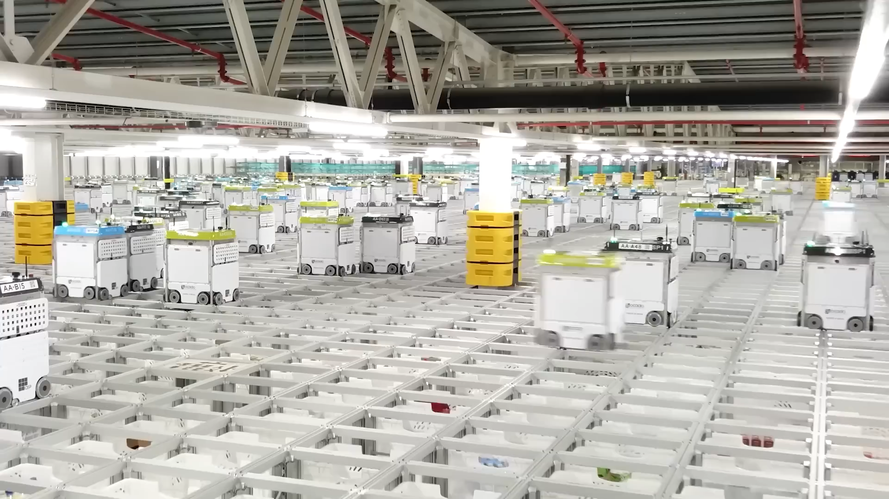
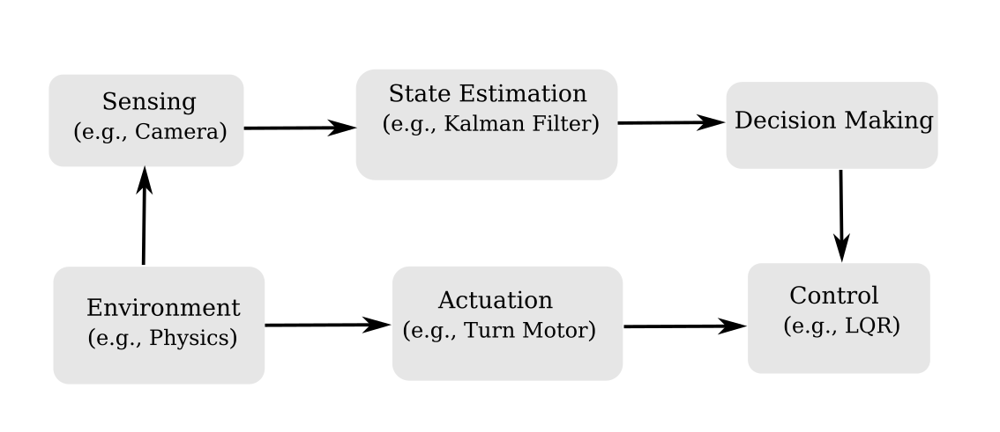

## Autonomy becomes Ubiquituos


{width=800}

Industry 4.0
<p style="font-size: 0.7em; color: gray;">Source: Keisuke Okumura</p>

. . . 

What is required to *build* these systems?

## The Classic Robotics Pipeline



. . .

::: {.container}

:::: {.col .element: class="fragment" data-fragment-index="2"}
::::: {.box-green}
Motion Planning is a *part of desicion making*: how to *reach the goal*, *given the state* of the robot and environment, without collisions.
:::::
::::
:::

## From One Robot to Many: Multi-Robot Planning

::: {.container}
:::: {.col .element: class="fragment" data-fragment-index="1"}
```{=html}
<video data-autoplay src="media/video/nu/alcove_unicycle_sphere1.mp4" width="100%"></video>
```
::::
:::: {.col .element: class="fragment" data-fragment-index="2"}
```{=html}
<video data-autoplay src="media/video/nu/alcove_unicycle_sphere2.mp4" width="100%"></video>
```
::::
:::

. . . 

- Joint configuration space

. . .

- Coupled constraints (inter-robot collision)

. . .

- Planning is no longer sequential


## Multi-Robot Planning 

::: {.container}
:::: {.col}
Multi-Agent Path Finding/MAPF (Discrete)
::::
:::: {.col}
Kinodynamic Motion Planning (Continuous)
::::
:::

# Multi-Agent Path Finding (MAPF)

## Multi-Agent Path Finding (MAPF)

Robots move on a graph, one step per timestep, from start to goal states.

::: {.container}
:::: {.col}
- Inputs: 
  - start, goal
  - environment
  - robot shape
- Output: 
  - sequence of states.
::::
:::: {.col}
{width=500}

::::
:::

. . .

::::: {.box-white}
Conflicts - egde and vertex.

Complexity - with each robot the joint configurations grows exponentially.
:::::

## MAPF Example

```{=html}
<video data-autoplay src="media/video/nu/mapf-example.mp4" width="60%"></video>
```
<p style="font-size: 0.7em; color: gray;">Source: Keisuke Okumura</p>

## Why MAPF Is Not Enough for Real Robots?

. . .

- Stop–go motion at each timestep

. . . 

- Relies on perfect time synchronization

. . .

- Ignores robots dynamics

. . .

MAPF captures combinatorial interaction, but *ignores* robot dynamics.

## Robot Dynamics in Motion Planning
::: {.box-def}
:::: {.box-blue-title}
Dynamics
::::
A function that describes the change of the configuration space, given the current configuration and control.
:::

. . .

::: {.box-green}
:::: {.box-green-title}
Car Dynamics
::::
We have actions $\mathbf{u} = (s, \phi)$, state $\mathbf{x} = (x, y, \theta)$, where $s$ is the speed, $\phi$ the steerig wheel angle, $x,y$ is the position, and $\theta$ is the orientation. The dynamics $\mathbf{\dot{x} = \mathbf{f}(\mathbf{x}, \mathbf{u})}$ are:

$\dot{x} = s \cos \theta, \quad \dot{y} = s \sin \theta, \quad \dot{\theta} = \frac{s}{L}\tan \phi$

:::
. . .

Planning now considers *how* to move, not just where.

# Kinodynamic Motion Planning

## Kinodynamic Motion Planning

Searches for *dynamically feasible*, *continuous time* trajectories for all robots simultaneously.

. . .

::: {.container}
:::: {.col}
- Inputs: 
  - start, goal
  - environment
  - robot shape
- Output: 
  - collision-free sequence of states, that obey *robot dynamics*.
::::
:::: {.col}
<video 
  data-autoplay 
  src="media/video/nu/kinodynamic-planner-example.mp4"
  style="width: 100%; margin: 30px auto; display: block;">
</video>
::::
:::

## How to solve?

- Extend discrete optimizers

```{=html}
<video data-autoplay src="media/video/nu/random8-problems-hetero.mp4" width="140%"></video>
```

## How to solve? 

- Extend discrete optimizers

```{=html}
<video data-autoplay src="media/video/nu/wall.mp4" width="140%"></video>
```

## How to solve? 

- Extend discrete optimizers
- Combine MAPF solvers with kinodynamic planning

```{=html}
<video data-autoplay src="media/video/maze-fast.mp4" width="60%"></video>
```


## Trajectory Feasibility

```{=html}
<video data-autoplay src="media/video/nu/dblacam.mp4" width="100%"></video>
```

## Trajectory Feasibility

```{=html}
<video data-autoplay src="media/video/nu/dbecbs-uav.mp4" width="100%"></video>
```

## Trajectory Feasibility

```{=html}
<video data-autoplay src="media/video/nu/dbecbs-polulu.mp4" width="140%"></video>
```

## 

Raxmet!

If you have questions contact me: moldagalieva@tu-berlin.de