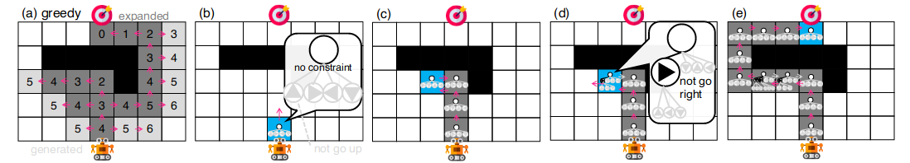
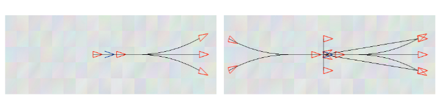

## Overview

- Multi-Robot Navigation
- Multi-Agent Path Finding
- Multi-Robot Motion Planning
- Research idea 
<!-- - Conclusion -->


## Multi-Robot Coordination

Safe navigation of robots from their starting states ($s_1$, $s_2$) to respective goal states ($g_1$ $g_2$).


```{=html}
<video data-autoplay src="media/video/db-lacam/mrmp-problem.mp4"></video>
```

## Multi-Agent Path Finding (MAPF)


## Multi-Agent Path Finding (MAPF)

Aims to assign collision-free paths on graphs to each agent. 

::: fragment
Assumptions: 
:::
::: fragment
- graph representation of the world
- synchronized motion of agents
:::

## MAPF solver: LaCam [@lacam] 

Graph path-finding algorithms that utilizes a lazy Depth-First Search (DFS) over configurations. 


[@okumura2024]

## MAPF solver: LaCam

::: {.container}

:::: {.col .element: class="fragment" data-fragment-index="1"}
::::: {.box-ex}
- super fast - 30s for 10.000 agents
- real-time and able to replan [@realtimelacam]

:::::
::::

:::

::: {.container}

:::: {.col .element: class="fragment" data-fragment-index="2"}
::::: {.box-red}
- ignores robot dynamics
:::::
::::

:::

## MAPF solver: LaCam-Freyja (lf)

Enhancements to reason about robot dynamics - use motion primitives

[@cohen]

:::fragment
::: {.box-red}
Hand-crafted motions can not generalize to complex robot dynamics
:::
:::

## Multi-Robot Motion Planning (MRMP)

Takes into account robot dynamics and actuation limits. Each robot $\textit{i}$ has dynamics:

$$
\begin{align}
\mathbf{\dot{x}}^{(i)} = \mathbf{f}^{(i)}(\mathbf{x}^{(i)}, \mathbf{u}^{(i)}),
\end{align}
$$

where $\mathbf{x}^{(i)} \in \mathcal{X}^{(i)} \subset \mathbb R^{d_{x^{(i)}}}$  is the state of the robot $\textit{i}$, which is actuated by controlling actions $\mathbf{u}^{(i)} \in \mathcal{U}^{(i)} \subset \mathbb R^{d_{u^{(i)}}}$. 


## MRMP planner: db-CBS/db-ecbs [@moldagalieva2024]

Reasons robot dynamics, actuation limits and generalizes to heterogeneous robot teams

```{=html}
<video data-autoplay src="media/video/db-lacam/dbcbs-dbecbs-main.mp4"></video>
```

## MRMP planner: db-CBS/db-ecbs
::: {.container}

:::: {.col .element: class="fragment" data-fragment-index="1"}
::::: {.box-ex}
- has theoretical properties
- robot dynamics are taken into account
- generalizes to heterogeneous robot teams
:::::
::::

:::

::: {.container}

:::: {.col .element: class="fragment" data-fragment-index="2"}
::::: {.box-red}
- slow 
- not able to replan
:::::
::::

:::

## Collaboration with K.Okumura, ProrokLab at Cambridge

## db-LaCam

A planner that is *fast*, generalizable to robots with *difficult dynamics*, capable of real-time *replanning* in response to new obstacles.


## db-LaCam

::: {.container}
:::: {.col}
::: {.box-def}
:::: {.box-def-title}
High-level plan
::::
- Stay at ProrokLab, Cambridge: 1.07-30.09.2025
- Robot dynamics: aeroplane with broken rudder, forklift, UAV
- Replan at: 20 Hz
- Baselines: AMSwarm[@amswarm], CB-MPS[@cbs-mpc], lf, db-CBS[@moldagalieva2024]
- Metrics: computation time, success rate, solution cost
:::
::::
:::

## Summary

::: fragment
- Multi-robot navigation relies on MAPF and/or MRMP planners to reach target locations
:::

::: fragment
- MAPF solvers are fast, but neglects robot dynamics
:::
::: fragment
- MRMP planners reason about robot dynamics, actuation limits. However, slow and not able to replan
:::
::: fragment
- Collaboration between ProrokLab and IMRC to develop a planner that is *fast*, generalizes to *challenging robot dynamics* and able to *replan*.
:::

## References

::: {#refs}
:::


