## The Classic Robotics Pipeline

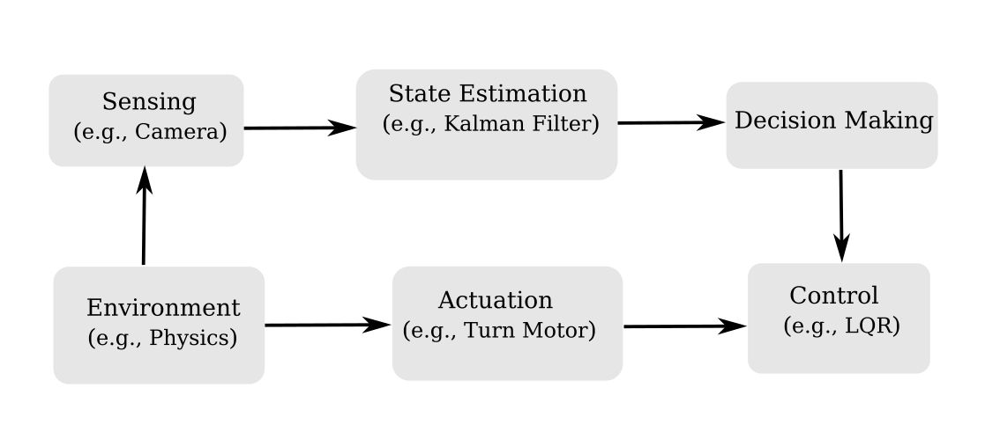

. . .

::: {.container}

:::: {.col .element: class="fragment" data-fragment-index="2"}
::::: {.box-green}
Motion Planning is a *part of desicion making*: how to *reach the goal*, *given the state* of the robot and environment, without collisions.
:::::
::::
:::

## Example Applications

::: {.container}
:::: {.col}
Mobile Robots
::::
:::: {.col}
Manipulators
::::
:::: {.col}
Computer Games
::::
:::: {.col}
Hybrid Systems
::::
:::

## Discrete vs. Continuous Planning 

::: {.container}
:::: {.col .element: class="fragment" data-fragment-index="1"}
::: {.box-white}
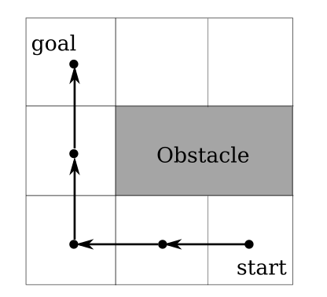
:::
- Discrete time steps
- Grid representation of the world
::::

:::: {.col .element: class="fragment" data-fragment-index="2"}
::: {.box-white}
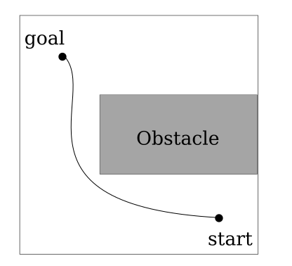
:::
- Continuous state & time
- Infinite possible motions
::::

:::

## From One Robot to Many: Multi-Robot Planning

::: {.container}
:::: {.col}
```{=html}
<video data-autoplay src="media/video/nu/alcove_unicycle_sphere1.mp4" width="100%"></video>
```
::::
:::: {.col}
```{=html}
<video data-autoplay src="media/video/nu/alcove_unicycle_sphere2.mp4" width="100%"></video>
```
::::
:::

. . . 

- Joint configuration space

. . .

- Coupled constraints (inter-robot collision)

. . .

- Planning is no longer sequential


## Multi-Robot Planning 

::: {.container}
:::: {.col}
Multi-Agent Path Finding/MAPF (Discrete)
::::
:::: {.col}
Kinodynamic Motion Planning (Continuous)
::::
:::


# Multi-Agent Path Finding (MAPF)


## Multi-Agent Path Finding (MAPF)

Robots move on a graph, one step per timestep, from start to goal states.

::: {.container}
:::: {.col}
- Inputs: 
  - start, goal
  - environment
  - robot shape
- Output: 
  - sequence of states.
::::
:::: {.col}
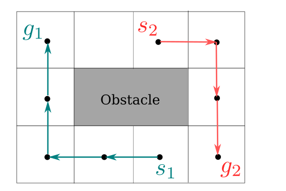

::::
:::

::::: {.box-white}
Conflicts - egde and vertex.

Complexity - with each robot the joint configurations grows exponentially.
:::::


## Why MAPF Is Not Enough for Real Robots?

. . .

- Stop–go motion at each timestep

. . . 

- Relies on perfect time synchronization

. . .

- Ignores robots dynamics

. . .

MAPF captures combinatorial interaction, but *ignores* robot dynamics.

## Robot Dynamics in Motion Planning
::: {.box-def}
:::: {.box-blue-title}
Dynamics
::::
A function that describes the change of the configuration space, given the current configuration and control.
:::

. . .

::: {.box-green}
:::: {.box-green-title}
Car Dynamics
::::
We have actions $\mathbf{u} = (s, \phi)$, state $\mathbf{x} = (x, y, \theta)$, where $s$ is the speed, $\phi$ the steerig wheel angle, $x,y$ is the position, and $\theta$ is the orientation. The dynamics $\mathbf{\dot{x} = \mathbf{f}(\mathbf{x}, \mathbf{u})}$ are:

$\dot{x} = s \cos \theta, \quad \dot{y} = s \sin \theta, \quad \dot{\theta} = \frac{s}{L}\tan \phi$

:::
. . .

Planning now considers *how* to move, not just where.


# Kinodynamic Motion Planning

## Kinodynamic Motion Planning

Searches for *dynamically feasible*, *continuous time* trajectories for all robots simultaneously.

. . .

::: {.container}
:::: {.col}
- Inputs: 
  - start, goal
  - environment
  - robot shape
- Output: 
  - collision-free sequence of states, that obey *robot dynamics*.
::::
:::: {.col}
<video 
  data-autoplay 
  src="media/video/nu/kinodynamic-planner-example.mp4"
  style="width: 100%; margin: 30px auto; display: block;">
</video>
::::
:::

## Kinodynamic Motion Planning Challenges

. . .

- Continuous state space

. . . 

- No waiting-in-place for free

. . .

- Synchronization is no longer guaranteed

. . .

- Dynamics restrict reachable states

. . . 

::::: {.box-green}
Given these difficulties, what properties must a planner have?
:::::


## Design Space of Multi-Robot Kinodynamic Planners

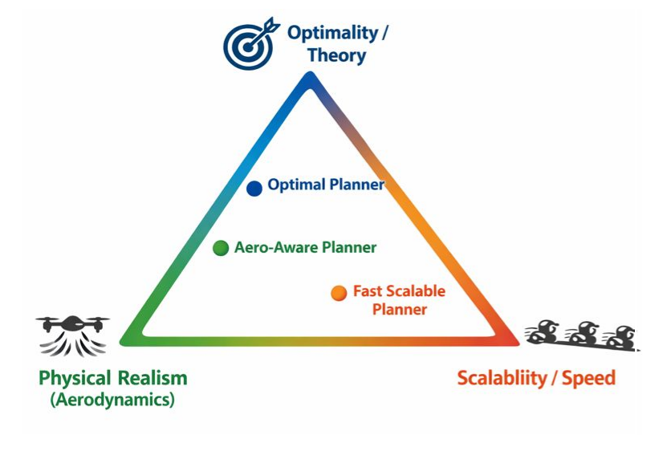
<p style="font-size: 0.7em; color: gray;">Source: ChatGPT</p>


## db-CBS Discontinuity-bounded Conflict-based Search
<p style="font-size: 0.7em; color: gray;">A. Moldagalieva, J.Ortiz-Haro, M.Toussaint, W.Honig (ICRA, 2024)</p>

## db-CBS - Overview

. . .

- anytime, probabilistically complete, asymptotic optimal

. . .

- respects robot dynamics

. . . 

- works with heterogeneous team of robots (flying, ground robots)

. . .


It searches a graph of motion primitives:
{width=600}

which follows robot dynamics $\mathbf{x}_{k+1} = \mathbf{f}(\mathbf{x}_k,\mathbf{u}_k)$

## db-CBS - Background

The planner, db-CBS, is built upon two core ideas: 

::: {.container}

:::: {.col .element: class="fragment"}
::: {.box-def}
:::: {.box-def-title}

Conflict-based Search 
::::

::: {.r-stack}
:::{.element: class="fragment"}
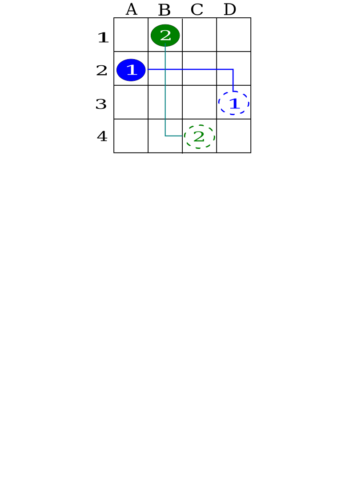{ width=340}
::::
:::{.element: class="fragment"}
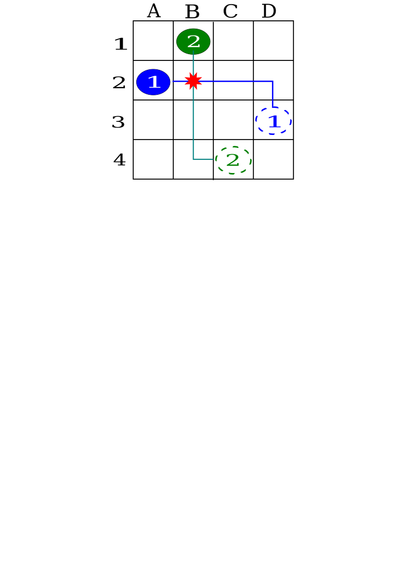{ width=340}
::::
:::{.element: class="fragment current-visible"}
{ width=340}
::::
:::{.element: class="fragment"}
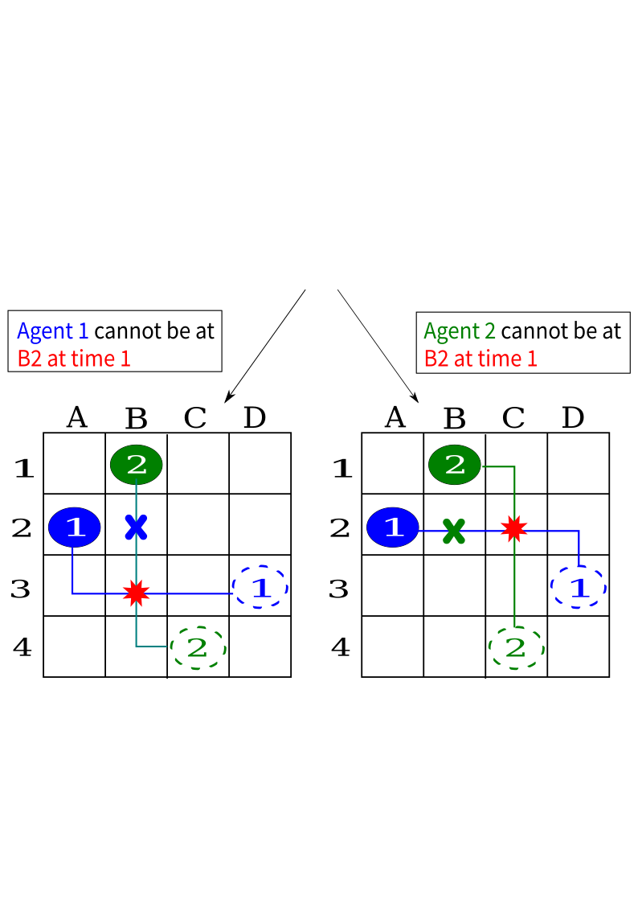{ width=340}
:::: 
:::{.element: class="fragment"}
{ width=340}
::::

:::
:::
::::

:::: {.col .element: class="fragment" }

::: {.box-def}
:::: {.box-def-title}
Discontinuity-bounded A* (db-A*)
::::

::: {.r-stack}
:::{.element: class="fragment current-visible"}
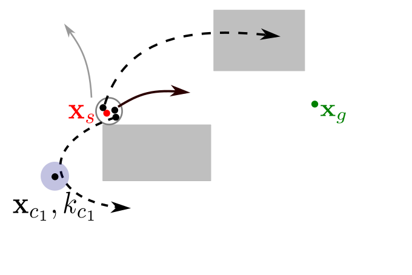{ width=440}
::::
:::{.element: class="fragment current-visible"}
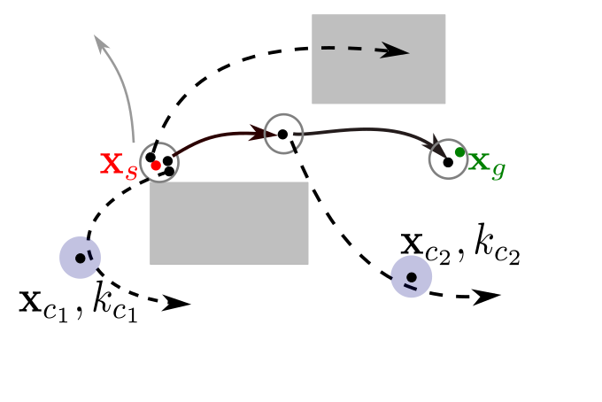{ width=440}
::::
:::{.element: class="fragment"}
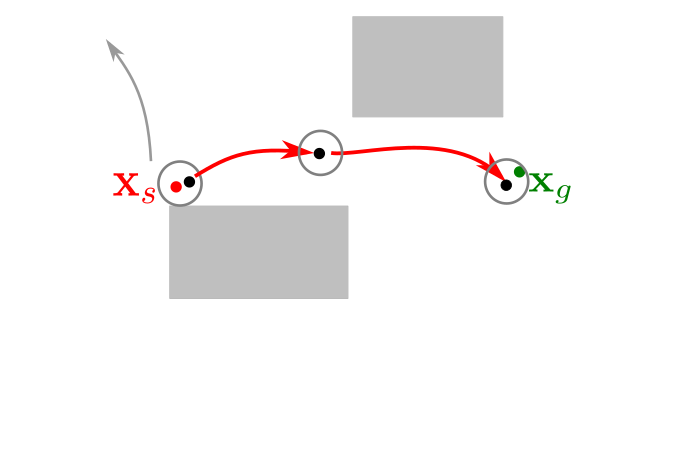{ width=440}
:::: 

:::

:::
::::

:::

## db-CBS - Approach

- step 1: All robot trajectories are generated using db-A*

- step 2: Inter-robot collisions are detected and resolved

- step 3: Robot trajectories are optimized.

## db-CBS - Approach

Step 1: All single robot trajectories are generated with db-A*

<video 
  data-autoplay 
  src="media/video/nu/dbcbs-step1.mp4"
  style="width: 100%; margin: 30px auto; display: block;">
</video>

## db-CBS - Approach

Step 2: Inter-robot collisions are detected and resolved by imposing constraints

<video 
  data-autoplay 
  src="media/video/nu/dbcbs-step2.mp4"
  style="width: 100%; margin: 30px auto; display: block;">
</video>

## db-CBS - Approach

Step 3: Discontinuities in collision-free trajectories are *repaired* with non-linear trajectory optimization

<video 
  data-autoplay 
  src="media/video/nu/dbcbs-step3.mp4"
  style="width: 100%; margin: 30px auto; display: block;">
</video>

## Anytime db-CBS

Add more primitives, decrease discontinuity

<video 
  data-autoplay 
  src="media/video/nu/dbcbs-anytime.mp4"
  style="width: 100%; margin: 30px auto; display: block;">
</video>

## Results? ...

## Summary

db-CBS is an *optimal* kinodynamic planner, that can handle a team of robots with different dynamics, actuation limits and shapes.

. . . 

::::: {.box-red}
Does not scale beyond 8 robots, ignores interaction force between robots.
:::::


## db-ECBS: Interaction-Aware Planner
<p style="font-size: 0.7em; color: gray;"> A.Moldagalieva, J.Ortiz-Haro, W.Hoenig (T-RO, 2025)</p>

## db-ECBS: Motivation 

Existing planners ignore *aerodynamic force* between flying robots, which can result in failure.

```{=html}
<video data-autoplay src="media/video/nu/downwash-effect.mp4" width="100%"></video>
```

## db-ECBS: Interaction-Awareness 

::: {.box-def}

::: {.r-stack}

:::{.element: class="fragment current-visible"}
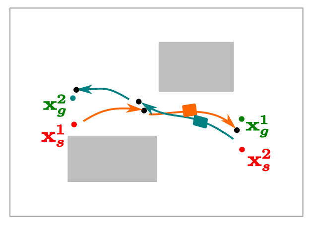

Robot 1 and Robot 2 colliding

::::
:::{.element: class="fragment current-visible"}
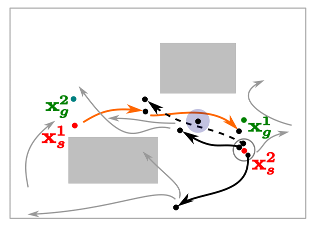

Avoid *constrainted state* (blue circ.)

::::
:::{.element: class="fragment current-visible"}
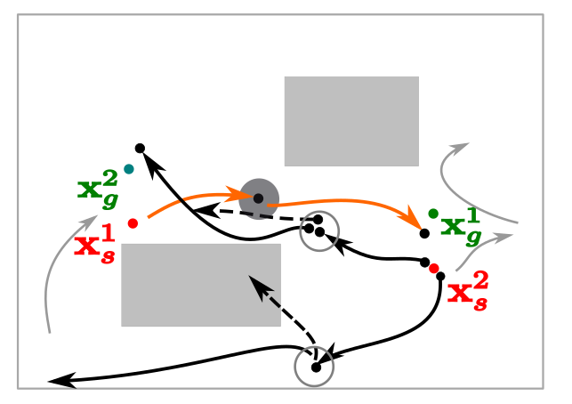

Avoid *interaction force violations* (grey circ.)

:::: 
:::{.element: class="fragment current-visible"}
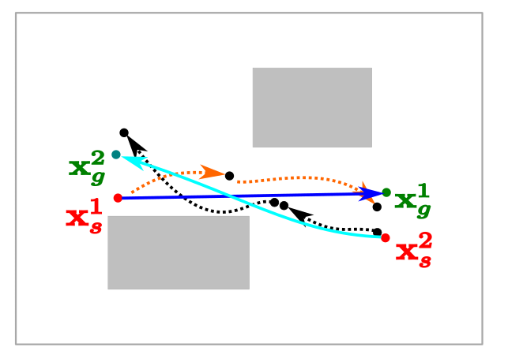

Optimize both robot trajectories 

::::
:::

:::

## db-ECBC: Results 

- Canonical Examples

- Dynamics: Unicycle ($1^{st}$ order) 

```{=html}
<video data-autoplay src="media/video/nu/canonical-problems.mp4" width="140%"></video>
```

## db-ECBC: Results

- Random start, goal states

- Dynamics: Unicycle ($1^{st}$ order)

```{=html}
<video data-autoplay src="media/video/nu/random8-problems.mp4" width="140%"></video>
```

## db-ECBC: Results 

- Random start, goal states (heterogeneous team)

- Dynamics: Unicycle ($1^{st}, 2^{nd}$ order), car with trailer, double integrator

```{=html}
<video data-autoplay src="media/video/nu/random8-problems-hetero.mp4" width="140%"></video>
```

## db-ECBS: Results (Interaction Awareness)

::: {.r-stack}

:::{.element: class="fragment"}
```{=html}
<video data-autoplay src="media/video/nu/swap3-drone.mp4" width="140%"></video>
```
::::

:::{.element: class="fragment current-visible"}
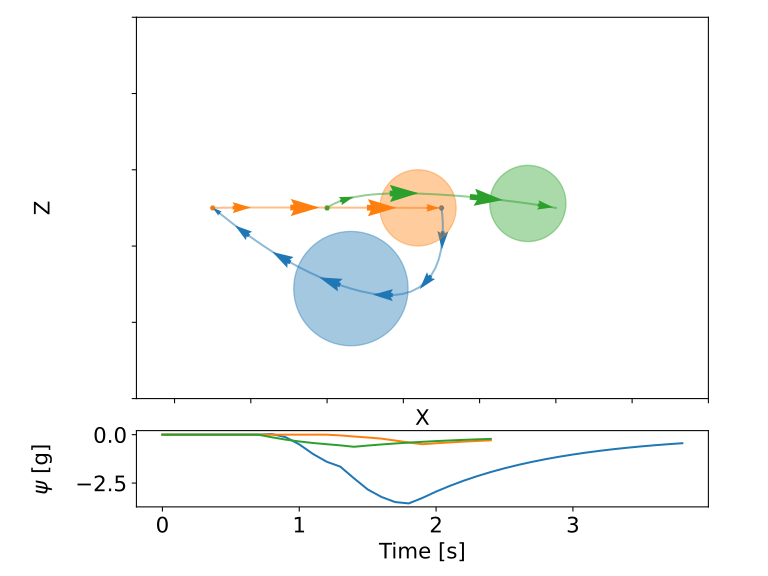

Interaction force ($\psi$) remains within threshold.

::::
:::

## db-ECBC: Results (Scalability)

- Wall example with 16 robots

- Dynamics: 3D double integrator

```{=html}
<video data-autoplay src="media/video/nu/wall.mp4" width="140%"></video>
```

## db-ECBC: Deployment on Real Platforms 

Platforms: Crazyflie drones, Polulu mobile robots

```{=html}
<video data-autoplay src="media/video/nu/real-robots.mp4" width="140%"></video>
```

## Summary

db-ECBS is a kinodynamic planner, that scales up to *16 robots*, and reasons about *aerodynamic force* between flying robots.

. . . 

::::: {.box-red}
Computationally heavy - slow, limited scalability.
:::::


## db-LaCAM: Fast and Scalable Planner 
<p style="font-size: 0.7em; color: gray;">A.Moldagalieva, K.Okumura, A.Prorok, W.Hoenig (AAAI, 2026)</p>

## db-LaCAM: Cool Video

## db-LaCAM: Approach 

## db-LaCAM: Results

