# Hyperparameters for db-ECBS motion planner {#preview}

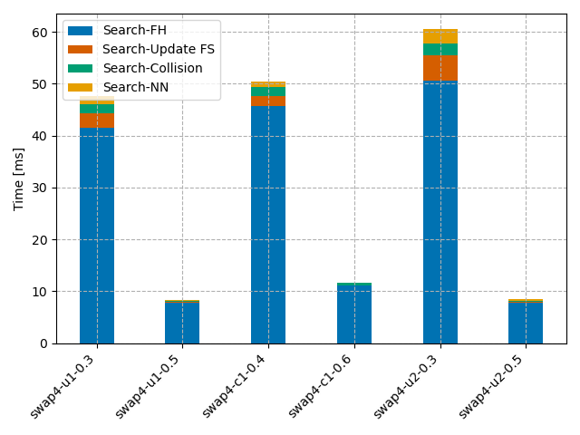


Large $\delta$ - needs few motion primitives &rarr; lower computation time <br>

Smaller $\delta$ - requires more motion primitives &rarr; higher computation time.


# discontinuity-bound value vs. Number of Motion Primitives {#preview}

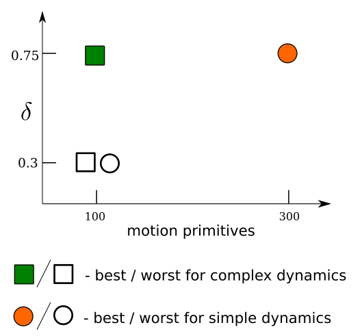


# Trajectory Optimization {#preview}

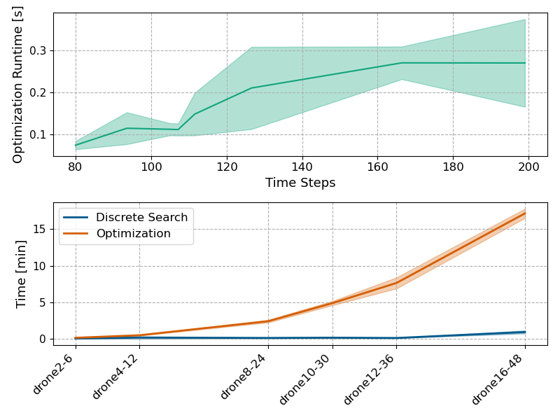

# Trajectory Optimization Complexity {#preview}

\begin{equation}
    \mathcal{O}\left(K\left(\sum_{i=1}^{N} \max\left(d_x^{(i)},d_u^{(i)}\right)\right)^3\right),
    \end{equation}

$d^{(i)}_x, d^{(i)}_u$ - state and action dimensions of robot $i$, 
$N$ - number of robots, 
$K = \max_{i \in N} K^{(i)}$, $K^{(i)}$ - number of time steps in the discrete search solution of the $i^{\text{th}}$ robot.


# Trajectory Optimization Failure {#preview}

. . . 

- Slow convergence due to the high number of decision variables &rarr; exceeds the time limit. <br>
<span style="color: green;">Solution: meta-optimization</span>

. . . 

- Poor discrete solution &rarr; collision violations. <br>
<span style="color: green;">Solution: provide *better* set of motion primitives</span>


# db-LaCAM: Livelock Handling {#preview}

Space-Cover and Goal-Oriented Clustering improved the solution quality

```{=html}
<video data-autoplay loop muted playsinline src="media/video/phd-defense/livelock-behaviour.mp4" width="80%"></video>
```
. . . 

Assumptions: 

- Accurate *h-value* estimation
- Given finite search space and expressive motion primitives

# db-LaCAM: Guarantees to resolve Livelocks {#preview}

# db-LaCAM: Livelock Handling {#preview}

Tight environments can cause livelocks

```{=html}
<video data-autoplay loop muted playsinline src="media/video/phd-defense/livelock-dblacam.mp4" width="100%"></video>
```
. . . 

<span style="color: green;">Solution: better heuristics, that could predict livelong settings and avoid it (GNN-based, f.i)</span>

# db-ECBS Node Expansion {#preview}

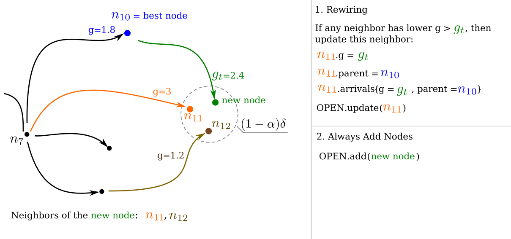


# db-CBS vs. db-ECBS with $\omega=1$

::: {.container}

:::: {.col}
::: {.box-def-two}
:::: {.box-blue-title}
db-CBS
::::

- f = g (cost-to-come) + h (<span style="color: green;">cost-to-go</span> )
- Discrete search runtime is 5.9 s (average)
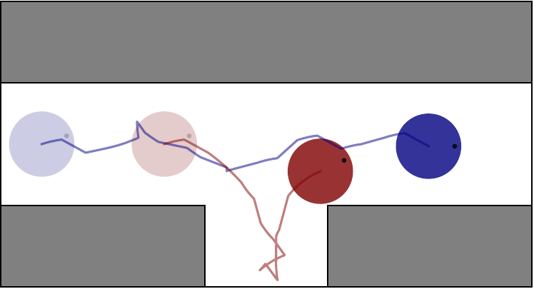

:::
::::

:::: {.col}
::: {.box-def-two}
:::: {.box-blue-title}
db-ECBS
::::

- f = g (cost-to-come) + h (<span style="color: green;">collisions</span> )
-  Discrete search runtime is 50.8 s (average)
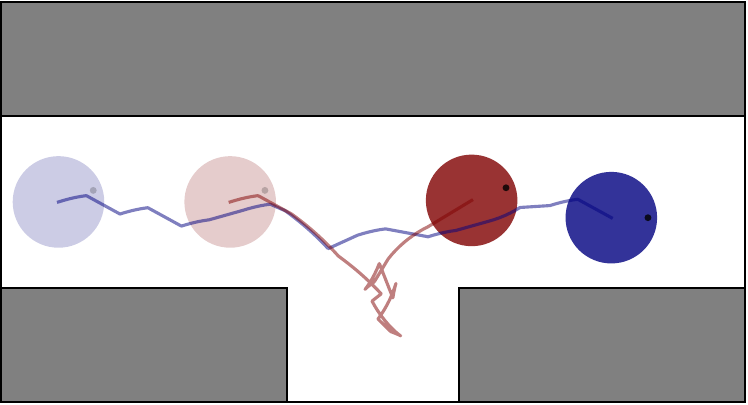

:::
::::

:::

Even though FOCAL = OPEN for db-ECBS


# db-CBS with Interaction Awareness

. . . 


- Change dynamics (as in db-ECBS)

$\dot{\mathbf{x}}^{(i)} = \mathbf{f}^{(i)}(\mathbf{x}^{(i)}, \mathbf{u}^{(i)})$  &rarr;  $\dot{\mathbf{x}}^{(i)} = \mathbf{f}^{(i)}(\mathbf{x}^{(i)}, \mathbf{u}^{(i)}, \mathbf{\psi}^{(i)}(\mathbf{r}^{(i)}))$, <br>
$\mathbf{\psi}^{(i)}(\cdot)$ - additional disturbance force.

. . .

- Create constraints from <span style="color: orange;">inter-robot interactions</span>, beyond collisions during the discrete search

# db-PIBT with Interaction Awareness

. . . 

- No need to alter the robot's state

- While rolling out motions, check each state for <span style="color: orange;">inter-robot interactions</span>, beyond collisions.

# db-ECBS with Omnidirectional Vision {#preview}

- Outdoor deployment
- No localization (except for starting state)
- Offline motion planning &rarr; Execution stage

. . . 

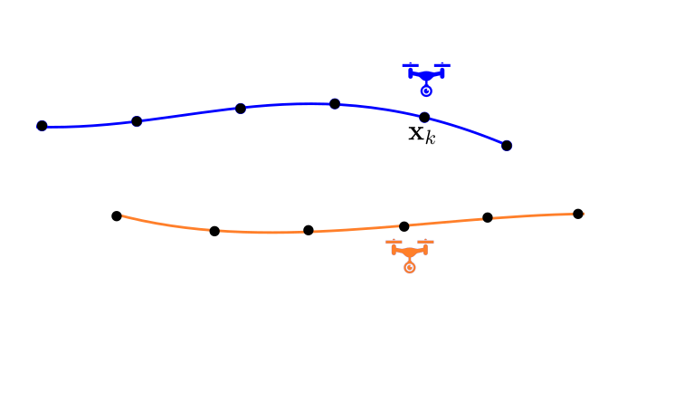


# db-ECBS with Omnidirectional Vision {#preview}


::: {.r-stack}

:::{.element: class="fragment current-visible"}


::::
:::{.element: class="fragment current-visible"}
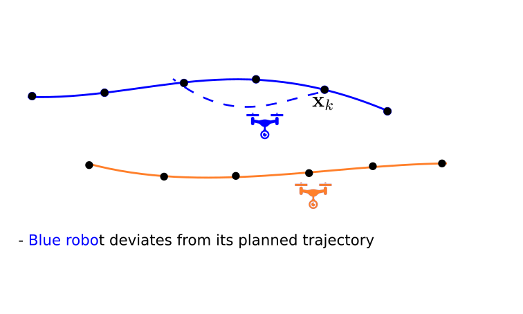

:::: 
:::{.element: class="fragment"}
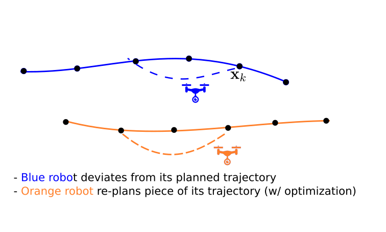
::::
:::


# Fixing the discontinuity {#preview}

::: {.container}

:::: {.col}
::: {.box-def-two-wide}
:::: {.box-blue-title}
w/ Rollout
::::
- 3D environment + <span style="color: red">narrow pass</span>
- High-dimensional dynamics - <span style="color: red">Lipschitz continuity</span> breaks
- <span style="color: red">Expensive search</span> with car-with-trailer

::: {.r-stack}
:::{.element: class="fragment current-visible"}
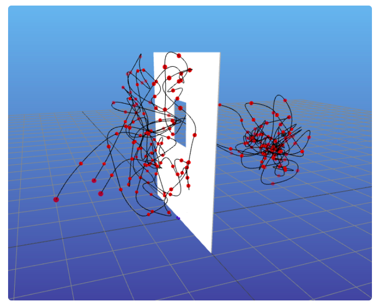
::::
:::{.element: class="fragment current-visible"}
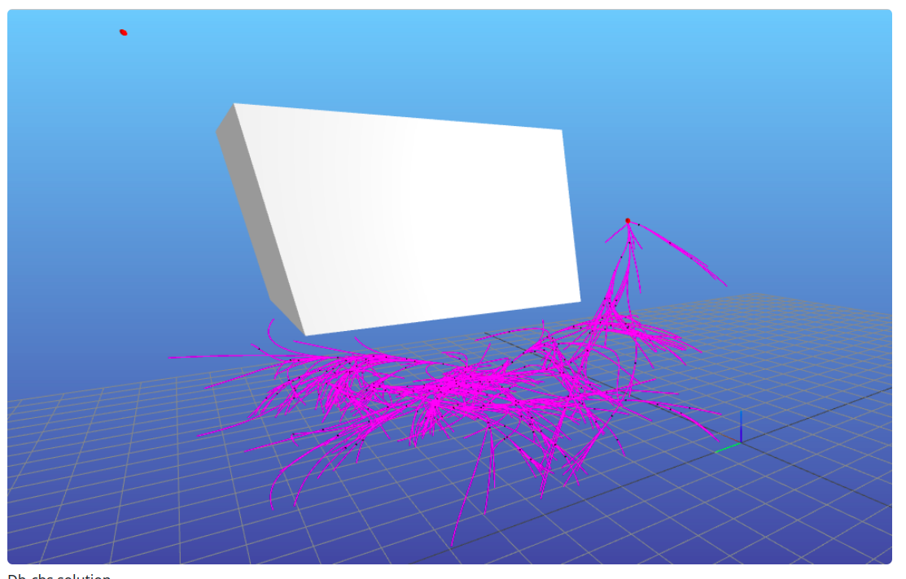
::::


:::

:::
::::


:::: {.col}
::: {.box-def-two-wide}
:::: {.box-blue-title}
w/ Optimization
::::
- <span style="color: red">Narrow pass</span> - collision violations
- <span style="color: red">Large environment</span>

:::{.element: class="fragment current-visible"}
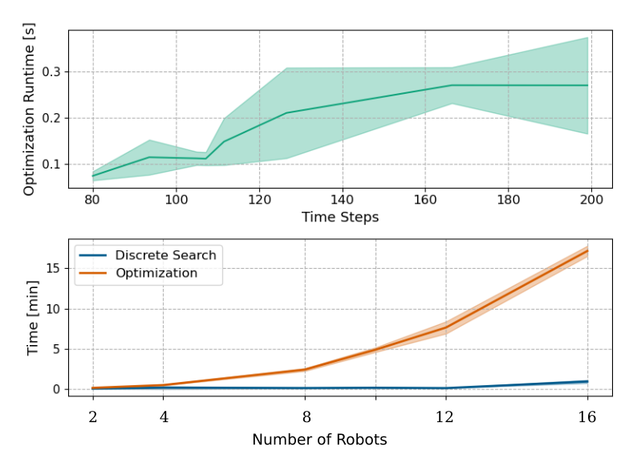
::::

:::
::::

:::


# Termination Guarantee for db-CBS/ECBS {#preview}

- Compute an upper-bound of the cost (w/ complete, suboptimal polynomial alg.)

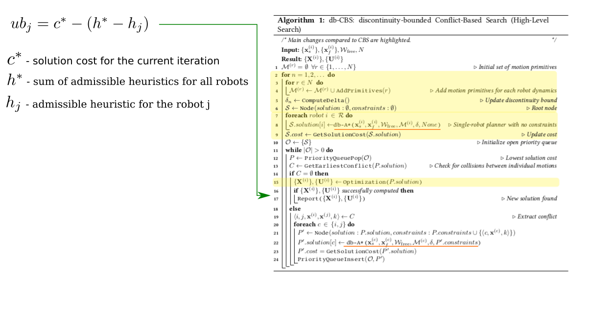


- OPEN set keeps nodes with cost < upper bound cost, this makes sure that the OPEN set gets empty.


# Benchmarking Problem Instances {#preview}

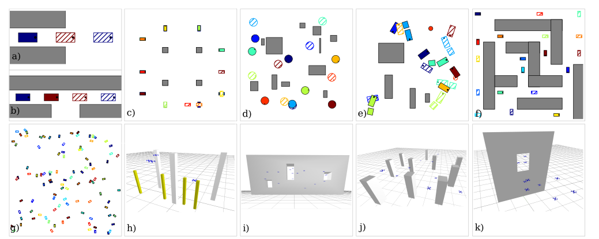


# Benchmarking Problem Instances {#preview}

::: {.container}

:::: {.col}
::: {.box-def-two}
:::: {.box-blue-title}
Environment Properties
::::
- Dimensions — width × height × height (2D/3D)
- Obstacle geometry — boxes, arbitrary meshes
- Obstacle size — dimensions/radius
- Obstacle placement — positions
- Narrow passages — minimum corridor/window width
:::
::::

:::: {.col}
::: {.box-def-two}
:::: {.box-blue-title}
Robot Properties
::::
- Number of robots
- Robot geometry — sphere, ellipsoid, box, etc.
- Robot size — radius / dimensions
- Robot state dimension
- Robot control dimension
- Robot state, action limits
- Dynamics model — integrator, unicycle, car-with-trailer, etc.
- Heterogeneity — whether robots have different dynamics, sizes
- Initial and goal states
:::
::::

:::
