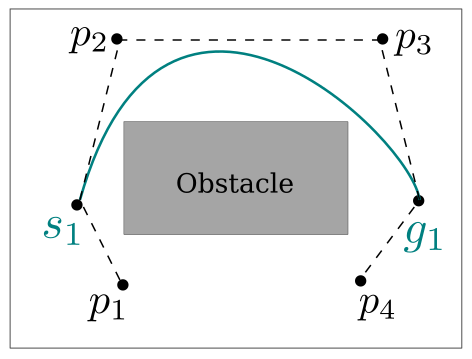
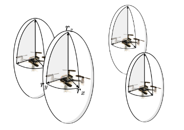
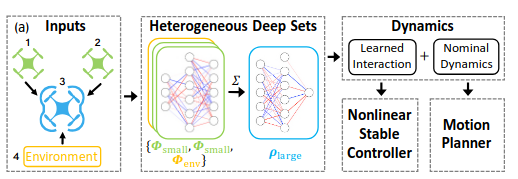

# Autonomous Multi-Robot Systems

Multiple robots can accomplish tasks that are impossible, inefficient, or unsafe for a single robot, enabling *scalable*, *robust*, and *efficient* operation in complex environments.


. . . 

Autonomy of a team of robots requires being able to reach the goal quickly while avoiding collisions with obstacles and other robots.

# Multi-Robot Coordination {#preview}


# Multi-Robot Coordination {#preview}

::: {.r-stack}
:::{.current-visible data-fragment-index="1"}

::::
:::{.fragment .current-visible data-fragment-index="2"}

:::: 
:::{.fragment .current-visible data-fragment-index="3"}

::::
:::


### Key Challenges in Multi-Robot Coordination

::: {data-fragment-index="1"}
- Time-Optimality: How fast can robots reach their goals?
:::

::: {.fragment  data-fragment-index="2"}
- Interaction-Awareness: How should robots coordinate in close proximity?
:::

::: {.fragment data-fragment-index="3"}
- Scalability & Efficiency: Can motion planning be fast and scalable?
:::


# Dissertation Contributions 

<div class="three-columns">

<div>
Time-Optimal Motion Planning


</div>

<div>
Interaction Awareness for Motion Planning


</div>

<div>
Safe, Fast Motion Planning


</div>

</div>

. . . 

::: {.box-green}
:::: {.box-green-title}
Research Vision
::::
Design a unified, *theoretically grounded* motion planning framework for *heterogeneous* robots that respects each robot’s *kinodynamic* constraints.
:::


# Presentation Overview

<ul class="overview">
  <li class="active">Introduction, Background</li>
  <li>Kinodynamic Motion Planning for Multi-Robot Systems</li>
</ul>

<div class="three-columns">

<div>
<b>Part I</b><br>
Time-Optimal Motion Planning

</div>

<div>
<b>Part II</b><br>
Interaction Awareness for Motion Planning

</div>

<div>
<b>Part III</b><br>
Safe, Fast Motion Planning

</div>

</div>

- Conclusion and Future Work


# Background: Multi-Robot Kinodynamic Motion Planning {#intro}

<video width="70%" autoplay muted loop playsinline>
  <source src="media/video/phd-defense/mrmp-problem.mp4" type="video/mp4">
</video>

Move each robot from its start state ($\mathbf{s}_1$, $\mathbf{s}_2$) to its goal state ($\mathbf{g}_1$, $\mathbf{g}_2$) while avoiding obstacles and collisions with other robots, and respecting *robot dynamics*.


# Background: Robot Dynamics {#preview}

Dynamics - function that describes the change of the configuration space, given the current configuration and control.

. . .

::: {.box-green}
:::: {.box-green-title}
Car-with-trailer Dynamics
::::
States $\mathbf{x} = (x, y, \theta_1, \theta_2)$, where $x,y$ is the position, and $\theta_1$, $\theta_2$ are the orientations for the car and trailer. Actions $\mathbf{u} = (v, \phi)$, where $v$ is linear velocity, $\phi$ the steerig angle. 
$L$ is the car wheelbase, $L_h$ is the hitch length.
The dynamics $\mathbf{\dot{x} = \mathbf{f}(\mathbf{x}, \mathbf{u})}$ are:

$\dot{x} = v \cos \theta_1, \quad \dot{y} = v \sin \theta_1, \quad \dot{\theta_1} = \frac{v}{L}\tan \phi$,  $\quad \dot{\theta_2} = \frac{v}{L_h} \sin (\theta_1 - \theta_2)$

:::

{width=400}


# Background: discontinuity-bounded Search with Motion Primitives {#preview}

Motion primitive - short trajectories, which follows robot dynamics $\mathbf{x}_{k+1} = \mathbf{f}(\mathbf{x}_k,\mathbf{u}_k)$

{width=500}

. . . 

discontinuity-bounded Search - allows for an user-defined discontinuity ($\delta$) between states

{width=500}


# Presentation Overview

<ul class="overview">
  <li>Introduction, Background</li>
  <li class="active">Kinodynamic Motion Planning for Multi-Robot Systems</li>
</ul>

<div class="three-columns">

<div>
<b>Part I</b><br>
Time-Optimal Motion Planning

</div>

<div>
<b>Part II</b><br>
Interaction Awareness for Motion Planning

</div>

<div>
<b>Part III</b><br>
Safe, Fast Motion Planning

</div>

</div>

- Conclusion and Future Work

# Presentation Overview {#preview}

<ul class="overview">
  <li>Introduction, Background</li>
  <li>Kinodynamic Motion Planning for Multi-Robot Systems </li>
</ul>

<div class="three-columns">

<div>
<b><span style="color:#0072B2;">Part I</span></b><br>
<span style="color:#0072B2;">Time-Optimal Motion Planning</span>


<div style="font-size:0.75em;">
  <strong>(Ch. 4 – ICRA 2024)</strong><br>
  (Ch. 5 – Preprint)
</div>
</div>

<div>
<b>Part II</b><br>
Interaction Awareness for Motion Planning

</div>

<div>
<b>Part III</b><br>
Safe, Fast Motion Planning

</div>

</div>

- Conclusion and Future Work


# Part I. Time-Optimal Kinodynamic Motion Planning for Multi-Robot Systems {#preview}


# Related Work {#intro}

::: {.container}

:::: {.col}
::: {.box-def}
:::: {.box-blue-title}
MAPF
::::
- Optimal graph planning
- Scales to > 1000 agents
- <span style="color:red">Ignores robot dynamics</span>


<div style="font-size:0.6em; color:gray; margin-top:-1.1em;">
Sharon et al., 2015; SJ. Li, Chen, et al., 2021; Okumura, 2023b; 
</div>

:::
::::

:::: {.col}
::: {.box-def}
:::: {.box-blue-title}
MAPF + Post-processing
::::
- Dynamically feasible
- Smooth trajectories
- <span style="color:red">Suboptimal trajectories</span>


<div style="font-size:0.6em; color:gray; margin-top:-1.1em;">
Hönig et al., 2018; Luis et al., 2020;
</div>
:::
::::

:::: {.col}
::: {.box-def}
:::: {.box-blue-title}
Bezier/Spline-based 
::::
- Scale well
- <span style="color:red">Actuation limits ignored</span>
- <span style="color:red">Limited dynamics</span> 


<div style="font-size:0.6em; color:gray; margin-top:-1.1em;">
Senbaslar et al., 2023; Yan & Li, 2024;
</div>
:::
::::

:::

. . . 

Research Gap: 


- Kinodynamic feasibility — Respect the dynamics of each robot

. . . 

- Model generality — Support arbitrary robot dynamics

. . .

- Time optimality — Produce time-optimal solutions


# db-CBS: discontinuity-bounded Conflict-based Search for Multi-Robot Kinodynamic Motion Planning {#preview}

. . . 

::: {.box-green}
- Probabilistically complete and asymptotically optimal
- Finds near-optimal solutions quickly
- Supports arbitrary robot dynamics
:::


```{=html}
<video data-autoplay loop muted playsinline src="media/video/phd-defense/dbcbs-intro.mp4" width="90%"></video>
```

<div style="position:absolute; bottom:20px; left:40px; right:40px; font-size:0.75em; color:gray;">
Moldagalieva, A., Ortiz-Haro, J., Toussaint, M., Hönig, W. (2024)<i>db-CBS: Discontinuity-Bounded Conflict-Based Search for Multi-Robot Kinodynamic Motion Planning</i>, IEEE  International Conference on Robotics and Automation (ICRA).
</div>


# db-CBS: How works? {#preview}

::: {.r-stack}

:::{.element: class="fragment current-visible"}


::::
:::{.element: class="fragment current-visible"}


::::
:::{.element: class="fragment current-visible"}

::::
:::{.element: class="fragment current-visible"}

:::: 
:::{.element: class="fragment"}

::::
:::

# db-CBS: Theoretical Properties {#preview}

<div class="empty-box">
By adding more motion primitives and reducing disconinuity bound, the discrete search space becomes increasingly rich, yielding *asymptotic optimality*. 
Asymptotic optimality implies *probabilistic completeness*.
</div>


# db-CBS: Performance Evaluation {#preview} 

- Example: Random (eterogeneous)
- Dynamics: unicycle ($1^{(st)}$ order), car-with-trailer, double integrator

```{=html}
<video data-autoplay loop muted playsinline src="media/video/nu/dbcbs-scalability.mp4" width="100%"></video>
```


# db-CBS: Performance Evaluation {#preview} 

- Example: Random (heterogeneous)
- Dynamics: unicycle ($1^{(st)}, 2^{(nd)}$ order), car with trailer, double integrator

```{=html}
<video data-autoplay loop muted playsinline src="media/video/phd-defense/only-dbcbs.mp4" width="100%"></video>
```
. . . 


*Take away*: db-CBS achieves $50\text{-}65\%$ lower cost than the second-best planner (K-CBS).

# db-CBS is great, but ... {#preview}

. . . 

- Scales only up to 8 robots
- Ignores residual force between robots.

. . . 

::: {.box-green}
Part II addresses these limitations.
:::

# Presentation Overview {#preview}

<ul class="overview">
  <li>Introduction, Background</li>
  <li>Kinodynamic Motion Planning for Multi-Robot Systems </li>
</ul>

<div class="three-columns">

<div>
<b>Part I</b><br>
Time-Optimal Motion Planning


</div>

<div>
<b><span style="color:#0072B2;">Part II</span></b><br>
<span style="color:#0072B2;">Interaction Awareness for Motion Planning</span>


<div style="font-size:0.75em;">
  <strong>(Ch. 6 – T-RO 2025)</strong><br>
  <!-- <strong>(Ch. 7 – MRS 2023)</strong><br> -->
  (Ch. 7 – MRS 2023)

</div>

</div>

<div>
<b>Part III</b><br>
Safe, Fast Motion Planning


</div>

</div>

- Conclusion and Future Work

# Part II. Interaction Awareness for Motion Planning {#preview}


# Aerodynamic Force between Flying Robots {#preview}

```{=html}
<video data-autoplay loop muted playsinline src="media/video/phd-defense/downwash.mp4" width="100%"></video>
```

. . . 

::::: {.box-red}
Robots can deviate from planned trajectories, leading to crash.
:::::

# Related Work

::: {.container}

:::: {.col}
::: {.box-def-two}
:::: {.box-blue-title}
Conservative Planner
::::
- assumes ellipsoid shape around robots
- scales well ($\le$ 32 robots)
- <span style="color:red">fails in tight environments</span>



<div style="font-size:0.45em; color:gray; margin-top:0.1em;">
Sharon et al., 2015; Sharon et al., 2015; Sharon et al., 2015; 
</div>
:::
::::

:::: {.col}
::: {.box-def-two}
:::: {.box-blue-title}
Learning-based Planner
::::
- Learn residual dynamics
- Works with heterogeneous robots
- <span style="color:red">assumes simplified 2D dynamics</span>
- <span style="color:red">Poor scalability ($\le$ 3 robots)</span>



<div style="font-size:0.45em; color:gray; margin-top:0.5em;">
Sharon et al., 2015; Sharon et al., 2015; Sharon et al., 2015; 
</div>
:::
::::

:::

. . . 

Research Gap: 

- Navigate in tight environemnts (3D)
- Improve the scalability of db-CBS (2D)


# db-ECBS: Interaction-Aware Multi-Robot Kinodynamic Motion Planning {#preview}

. . . 

::: {.box-green}
- Probabilistically complete and asymptotically optimal
- Reasons about interaction force between robots
- Scales up to 16 robots
:::


```{=html}
<video data-autoplay loop muted playsinline src="media/video/phd-defense/dbecbs-intro.mp4" width="80%"></video>
```

<div style="position:absolute; bottom:-100px; left:40px; right:40px; font-size:0.75em; color:gray;">
Moldagalieva, A., Ortiz-Haro, J., Hönig, W. (2025) <i>db-ECBS: Interaction-Aware Multirobot Kinodynamic Motion Planning</i>, IEEE Transactions on Robotics (T-RO).
</div>


# db-ECBS: How Works? {#preview}

::: {.r-stack}

:::{.element: class="fragment current-visible"}

::::
:::{.element: class="fragment current-visible"}


::::
:::{.element: class="fragment current-visible"}

::::
:::{.element: class="fragment current-visible"}

:::: 
:::{.element: class="fragment current-visible"}

::::
:::{.element: class="fragment"}

::::
:::

# db-ECBS: Theoretical Properties {#preview}

<div class="empty-box">
As in db-CBS, adding more motion primitives and reducing the discontinuity bound progressively enriches the search space, yielding *asymptotic bounded suboptimality* and *probabilistic completeness*.
</div>


# db-ECBS: Performance Evaluation {#preview}


# db-ECBS: Summary {#preview}


# Presentation Overview {#preview}

<ul class="overview">
  <li>Introduction, Background</li>
  <li>Kinodynamic Motion Planning for Multi-Robot Systems </li>
</ul>

<div class="three-columns">

<div>
<b>Part I</b><br>
Time-Optimal Motion Planning


</div>

<div>
<b>Part II</b><br>
Interaction Awareness for Motion Planning


</div>

<div>
<b><span style="color:#0072B2;">Part III</span></b><br>
<span style="color:#0072B2;">Safe, Fast Motion Planning</span>


<div style="font-size:0.75em;">
  <strong>(Ch. 7 – ICAPS 2026)</strong><br>
</div>

</div>

</div>

- Conclusion and Future Work

# Part III. Fast, Scalable Multi-Robot Motion Planning {#preview}

# Computational Effort in Kinodynamic Motion Planning {#preview}


. . . 

::::: {.box-red}
With the increasing number of robots, the computational burden increases.
:::::

# db-lacam: Fast and scalable multi-robot kinodynamic motion planning with discontinuity-bounded search and lightweight MAPF {#preview}

. . . 

::: {.box-green}
- Scalability up to 50 robots
- Computational runtime up to 10x faster
:::


```{=html}
<video data-autoplay loop muted playsinline src="media/video/icaps/icaps-gif.mp4" width="80%"></video>
```

<div style="position:absolute; bottom:-100px; left:40px; right:40px; font-size:0.75em; color:gray;">
Moldagalieva, A., Okumura, K., Prorok, A., Hönig, W. (2026) <i> db-lacam: Fast and scalable multi-robot kinodynamic motion planning with discontinuity-bounded search and lightweight MAPF</i>, International Conference on Automated Planning and Scheduling (ICAPS).
</div>


# db-LaCAM: How Works? {#preview}

::: {.r-stack}

:::{.element: class="fragment current-visible"}

::::
:::{.element: class="fragment current-visible"}

::::
:::{.element: class="fragment current-visible"}

::::
:::{.element: class="fragment current-visible"}

:::: 
:::{.element: class="fragment current-visible"}

::::
:::{.element: class="fragment current-visible"}

::::
:::{.element: class="fragment current-visible"}

::::
:::{.element: class="fragment"}

::::
:::


# db-LaCAM: Theoretical Properties {#preview}

<div class="empty-box">
db-LaCAM is *probabilistically complete up to the resolution* of its motion-primitive graph. 
Exhaustive search eventually finds a solution, while stochastic motion sampling gives a non-zero probability of selecting the required motions.
</div>

# db-LaCAM: Performance Evaluation {#preview}


# db-LaCAM: Summary {#preview}


# Conclusion: Impact of Research Results

::: {.box-green}
:::: {.box-green-title}
Physically realistic planning &rarr; Real-world deployment
::::
- Plan motions that respect what robots can actually execute
- Move beyond simplified models to heterogeneous robot dynamics
- Bring multi-robot planning closer to real-world autonomous operation
:::


# Conclusion: Summary of Contributions {#preview}

<ul class="overview">
  <li>Kinodynamic Motion Planning for Multi-Robot Systems </li>
</ul>

<div class="three-columns">

<div class="part-column">
<b>Part I</b><br>
Time-Optimal Motion Planning
</div>


<div class="part-column">
<b>Part II</b><br>
Interaction Awareness for Motion Planning
</div>


<div class="part-column">
<b>Part III</b><br>
Safe, Fast Motion Planning
</div>

</div>

. . . 


<div class="parts-result-boxes">

  <div class="result-box">
  - high-quality solutions
  - scalability across heterogeneous robot dynamics
  <br>
  <span style="color: #0072B2; position: relative; top: 130px; left: 5px;">
    (Ch. 4 - ICRA 2024)<br>
    (Ch. 5 - Preprint)
  </span>
  </div>

  <div class="result-box">
  - safe trajectories in dense formations
  - scalability up to 16 robots
  <br>
  <span style="color: #0072B2; position: relative; top: 160px; left: 5px;">
    (Ch. 6 - T-RO 2025)<br>
    (Ch. 7 - MRS 2023)
  </span>
  </div>

  <div class="result-box">
  - computational runtime improvement up to $10\times$
  - scalability up to 50 robots
  <br>
  <span style="color: #0072B2; position: relative; top: 160px; left: 5px;">
    (Ch. 8 - ICAPS 2026)
  </span>
  </div>

</div>


# Conclusion: Limitations {#preview}

<ul class="overview">
  <li>Kinodynamic Motion Planning for Multi-Robot Systems </li>
</ul>

<div class="three-columns">

<div class="part-column">
<b>Part I</b><br>
Time-Optimal Motion Planning
</div>


<div class="part-column">
<b>Part II</b><br>
Interaction Awareness for Motion Planning
</div>


<div class="part-column">
<b>Part III</b><br>
Safe, Fast Motion Planning
</div>

</div>

. . . 

<div class="parts-result-boxes">

  <div class="result-red-box">
  In obstacle-dense environments, the planner can spend significant time resolving conflicts.
  </div>

  <div class="result-red-box">
  The joint-state space trajectory optimization scales poorly with large robot teams.
  </div>

  <div class="result-red-box">
  With non-accurate heuristic estimation, the planner can be inefficient.
  </div>

</div>


# Open Challenges and Future Work {#preview}

. . .

- Motion planning for unmodeled dynamics - <span style="color: red;">
  Difficult to model dynamics, that are under external disturbances
  </span>

. . .

- Task and Motion Planning Integration/*System-level Intelligence* - Internal decision-making mechanisms that allocate tasks based on individual capabilities and global objectives.

. . . 

- Real-Time Performance and Guarantees - Balancing formal guarantees with real-time computational performance.

. . . 

- Benchmarking and Standardization - Reproducibility and fair comparison between different methods.


# Thanks to

all my collaborators and co-authors!

# References I