# Autonomous Multi-Robot Systems

Multiple robots can accomplish tasks that are impossible, inefficient, or unsafe for a single robot, enabling *scalable*, *robust*, and *efficient* operation in complex environments.


. . . 

Autonomy of a team of robots requires being able to reach the goal quickly while avoiding collisions with obstacles and other robots.

# Multi-Robot Coordination {#preview}

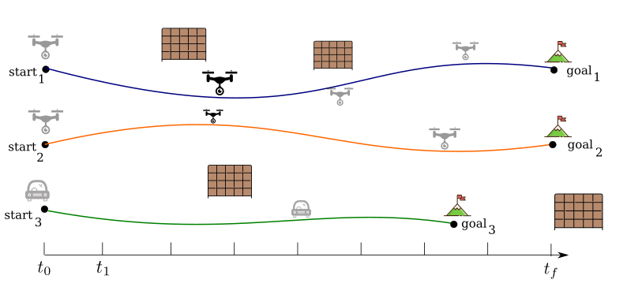

# Multi-Robot Coordination {#preview}

::: {.r-stack}
:::{.current-visible data-fragment-index="1"}
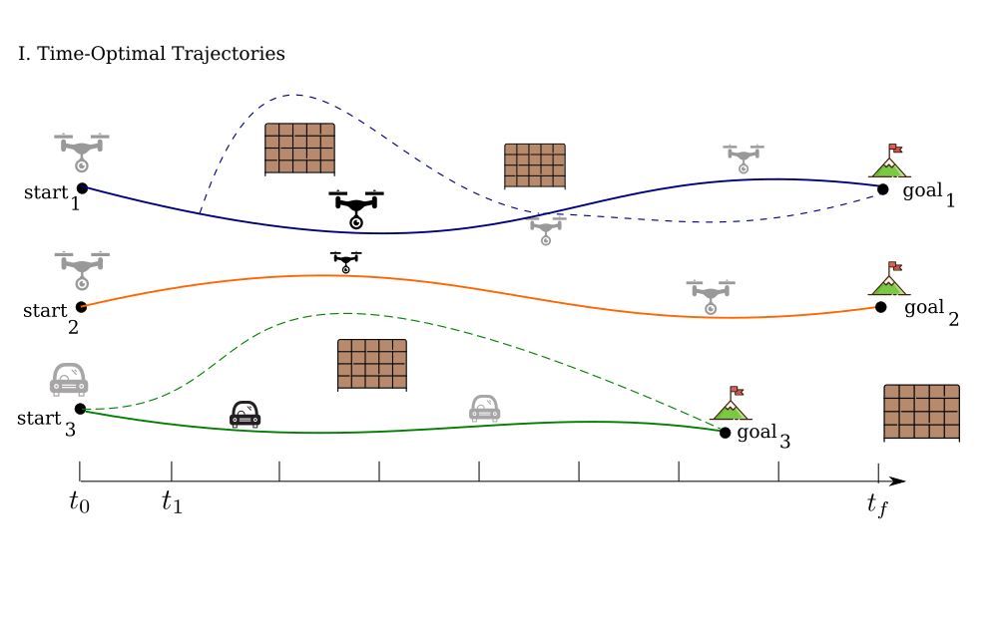
::::
:::{.fragment .current-visible data-fragment-index="2"}
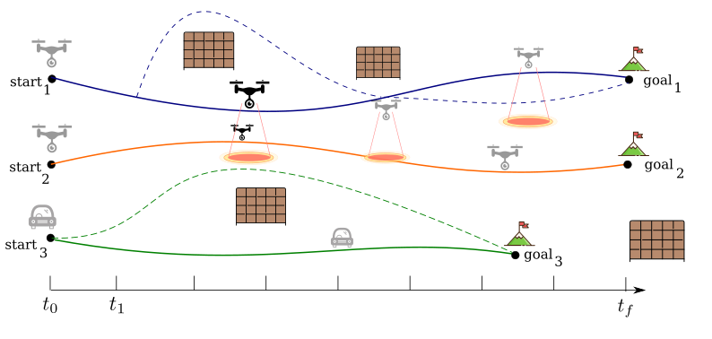
:::: 
:::{.fragment .current-visible data-fragment-index="3"}
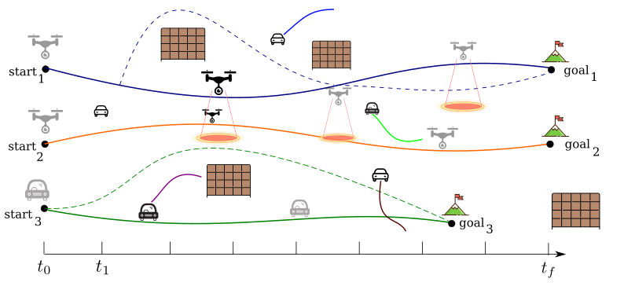
::::
:::


### Key Challenges

::: {data-fragment-index="1"}
- Time-Optimality: Suboptimal solutions (<span style="font-size:0.6em; color:gray;">(Sharon et al., 2015)</span>)
:::

::: {.fragment  data-fragment-index="2"}
- Interaction-Awareness: Deviate from planned trajectories, conservative assumptions (<span style="font-size:0.6em; color:gray;">(Sharon et al., 2015)</span>)
:::

::: {.fragment data-fragment-index="3"}
- Scalability, Efficiency: Computationally expensive, limited scalability (<span style="font-size:0.6em; color:gray;">(Sharon et al., 2015)</span>)
:::


# Dissertation Contributions 

<div class="three-columns">

<div>
Time-Optimal Motion Planning


</div>

<div>
Interaction Awareness for Motion Planning


</div>

<div>
Safe, Fast Motion Planning


</div>

</div>

. . . 

::: {.box-green}
:::: {.box-green-title}
Research Vision
::::
Design a unified, *theoretically grounded* motion planning framework for *heterogeneous* robots that respects each robot’s *kinodynamic* constraints.
:::

<!-- # Presentation Overview

<ul class="overview">
  <li>Introduction, Background</li>
  <li> Kinodynamic Motion Planning for Multi-Robot Systems</li>
</ul>

<div class="three-columns">

<div>
<b>Part I</b><br>
Time-Optimal Motion Planning

</div>

<div>
<b>Part II</b><br>
Interaction Awareness for Motion Planning

</div>

<div>
<b>Part III</b><br>
Safe, Fast Motion Planning

</div>

</div>

- Conclusion and Future Work -->

# Presentation Overview

<ul class="overview">
  <li class="active">Introduction, Background</li>
  <li>Kinodynamic Motion Planning for Multi-Robot Systems</li>
</ul>

<div class="three-columns">

<div>
<b>Part I</b><br>
Time-Optimal Motion Planning

</div>

<div>
<b>Part II</b><br>
Interaction Awareness for Motion Planning

</div>

<div>
<b>Part III</b><br>
Safe, Fast Motion Planning

</div>

</div>

- Conclusion and Future Work


# Background: Multi-Robot Kinodynamic Motion Planning {#intro}

<video width="70%" autoplay muted loop playsinline>
  <source src="media/video/phd-defense/mrmp-problem.mp4" type="video/mp4">
</video>

Move each robot from its start state ($\mathbf{s}_1$, $\mathbf{s}_2$) to its goal state ($\mathbf{g}_1$, $\mathbf{g}_2$) while avoiding obstacles and collisions with other robots, and respecting *robot dynamics*.

# Background: Robot Dynamics

# Presentation Overview

<ul class="overview">
  <li>Introduction, Background</li>
  <li class="active">Kinodynamic Motion Planning for Multi-Robot Systems</li>
</ul>

<div class="three-columns">

<div>
<b>Part I</b><br>
Time-Optimal Motion Planning

</div>

<div>
<b>Part II</b><br>
Interaction Awareness for Motion Planning

</div>

<div>
<b>Part III</b><br>
Safe, Fast Motion Planning

</div>

</div>

- Conclusion and Future Work

# Presentation Overview {#preview}

<ul class="overview">
  <li>Introduction, Background</li>
  <li>Kinodynamic Motion Planning for Multi-Robot Systems </li>
</ul>

<div class="three-columns">

<div>
<b><span style="color:#0072B2;">Part I</span></b><br>
<span style="color:#0072B2;">Time-Optimal Motion Planning</span>


<div style="font-size:0.75em;">
  <strong>(Ch. 4 – ICRA 2024)</strong><br>
  (Ch. 5 – Preprint)
</div>
</div>

<div>
<b>Part II</b><br>
Interaction Awareness for Motion Planning

</div>

<div>
<b>Part III</b><br>
Safe, Fast Motion Planning

</div>

</div>

- Conclusion and Future Work


# Part I. Time-Optimal Kinodynamic Motion Planning for Multi-Robot Systems {#preview}


# Related Work {#intro}

::: {.container}

:::: {.col}
::: {.box-def}
:::: {.box-blue-title}
MAPF
::::
- Optimal graph planning
- Scales to > 1000 agents
- <span style="color:red">Ignores robot dynamics</span>


<div style="font-size:0.45em; color:gray; margin-top:0.1em;">
Sharon et al., 2015; Sharon et al., 2015; Sharon et al., 2015; 
</div>

:::
::::

:::: {.col}
::: {.box-def}
:::: {.box-blue-title}
MAPF + Post-processing
::::
- Dynamically feasible
- Smooth trajectories
- <span style="color:red">Suboptimal trajectories</span>


<div style="font-size:0.45em; color:gray; margin-top:0.1em;">
Sharon et al., 2015; Sharon et al., 2015; Sharon et al., 2015; 
</div>
:::
::::

:::: {.col}
::: {.box-def}
:::: {.box-blue-title}
Differential Flatness 
::::
- Scale well
- <span style="color:red">Actuation limits ignored</span>
- <span style="color:red">Limited dynamics</span> 


<div style="font-size:0.45em; color:gray; margin-top:0.1em;">
Sharon et al., 2015; Sharon et al., 2015; Sharon et al., 2015; 
</div>
:::
::::

:::

. . . 

Research Gap: 

- Respects robot dynamics
- Supports arbitrary robot dynamics
- Produces time-optimal solutions


# db-CBS: discontinuity-bounded Conflict-based Search for Multi-Robot Kinodynamic Motion Planning {#preview}

. . . 

::: {.box-green}
- Probabilistically complete and asymptotically optimal
- Finds near-optimal solutions quickly
- Supports arbitrary robot dynamics
:::


```{=html}
<video data-autoplay loop muted playsinline src="media/video/phd-defense/dbcbs-intro.mp4" width="90%"></video>
```

<div style="position:absolute; bottom:20px; left:40px; right:40px; font-size:0.75em; color:gray;">
Moldagalieva, A., Ortiz-Haro, J., Toussaint, M., Hönig, W. (2024)<i>db-CBS: Discontinuity-Bounded Conflict-Based Search for Multi-Robot Kinodynamic Motion Planning</i>, IEEE  International Conference on Robotics and Automation (ICRA).
</div>


<!-- # db-CBS: Main Idea {#preview} -->

# db-CBS: How it works? {#preview}

::: {.r-stack}

:::{.element: class="fragment current-visible"}
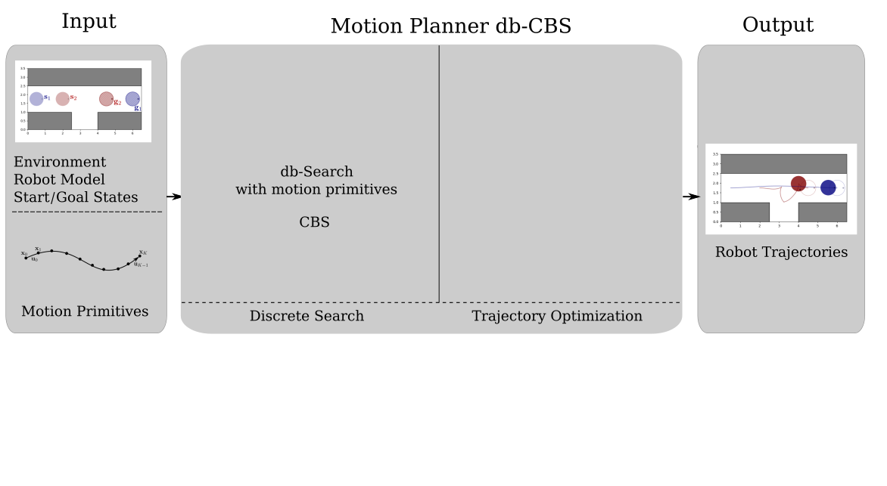

::::
:::{.element: class="fragment current-visible"}
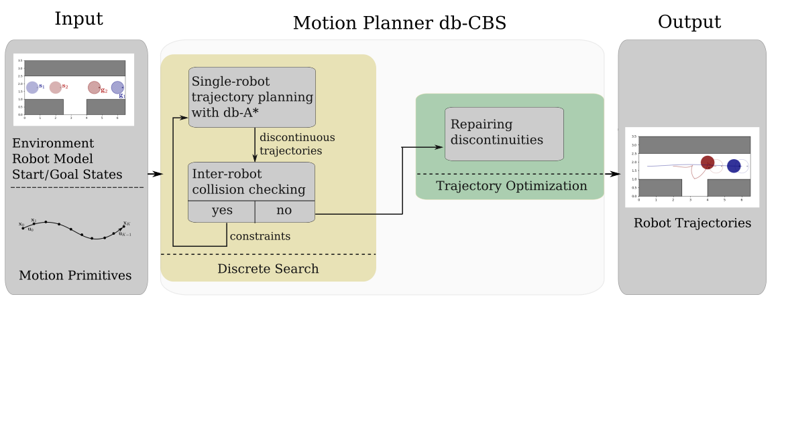

::::
:::{.element: class="fragment current-visible"}
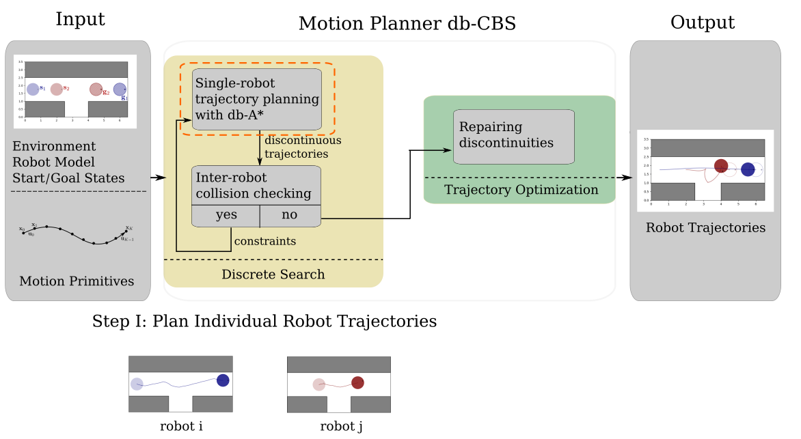
::::
:::{.element: class="fragment current-visible"}
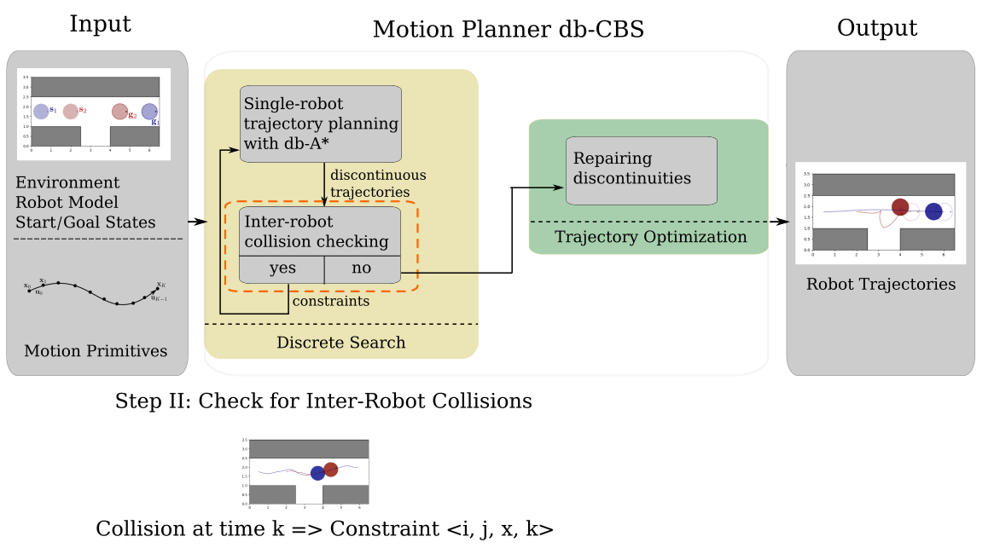
:::: 
:::{.element: class="fragment"}
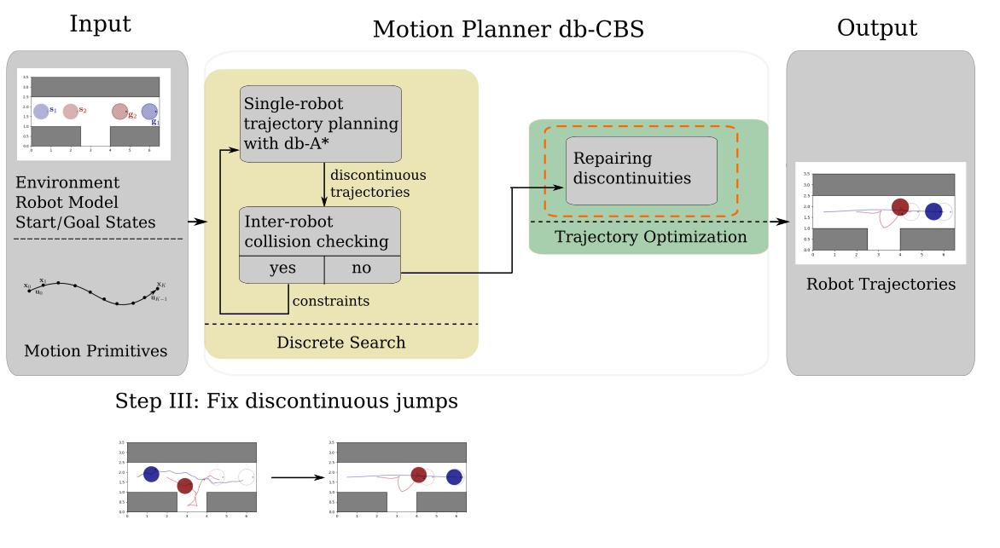
::::
:::

# db-CBS: Theoretical Properties {#preview}

<div class="empty-box">
By adding more motion primitives and reducing disconinuity bound, the discrete search space becomes increasingly rich, yielding *asymptotic optimality*. 
Asymptotic optimality implies *probabilistic completeness*.
</div>


# db-CBS: Performance Evaluation {#preview} 


# db-CBS is great, but ... {#preview}

. . . 

- Scales only up to 8 robots - computationally expensive
- Ignore residual force between robots.

. . . 

::: {.box-green}
Part II addresses these limitations.
:::

# Presentation Overview {#preview}

<ul class="overview">
  <li>Introduction, Background</li>
  <li>Kinodynamic Motion Planning for Multi-Robot Systems </li>
</ul>

<div class="three-columns">

<div>
<b>Part I</b><br>
Time-Optimal Motion Planning


</div>

<div>
<b><span style="color:#0072B2;">Part II</span></b><br>
<span style="color:#0072B2;">Interaction Awareness for Motion Planning</span>


<div style="font-size:0.75em;">
  <strong>(Ch. 6 – T-RO 2025)</strong><br>
  <!-- <strong>(Ch. 7 – MRS 2023)</strong><br> -->
  (Ch. 7 – MRS 2023)

</div>

</div>

<div>
<b>Part III</b><br>
Safe, Fast Motion Planning


</div>

</div>

- Conclusion and Future Work

# Part II. Interaction Awareness for Motion Planning {#preview}


# Aerodynamic Force between Flying Robots {#preview}

```{=html}
<video data-autoplay loop muted playsinline src="media/video/phd-defense/downwash.mp4" width="100%"></video>
```

. . . 

::::: {.box-red}
Robots can deviate from planned trajectories, leading to crash.
:::::

# Related Work

. . . 

Research Gap


# db-ECBS: Interaction-Aware Multi-Robot Kinodynamic Motion Planning {#preview}

. . . 

::: {.box-green}
- Probabilistically complete and asymptotically optimal
- Reasons about interaction force between robots
- Scales up to 16 robots
:::


```{=html}
<video data-autoplay loop muted playsinline src="media/video/phd-defense/dbecbs-intro.mp4" width="80%"></video>
```

<div style="position:absolute; bottom:-100px; left:40px; right:40px; font-size:0.75em; color:gray;">
Moldagalieva, A., Ortiz-Haro, J., Hönig, W. (2025) <i>db-ECBS: Interaction-Aware Multirobot Kinodynamic Motion Planning</i>, IEEE Transactions on Robotics (T-RO).
</div>


# db-ECBS: How It Works? {#preview}

::: {.r-stack}

:::{.element: class="fragment current-visible"}
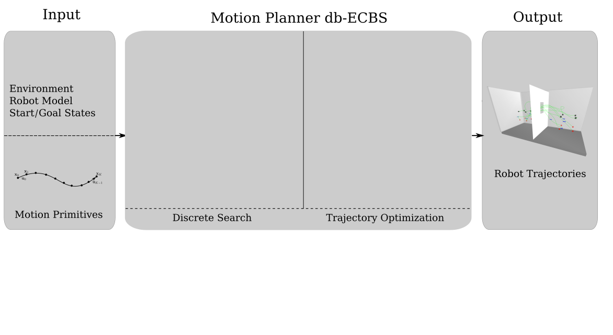
::::
:::{.element: class="fragment current-visible"}
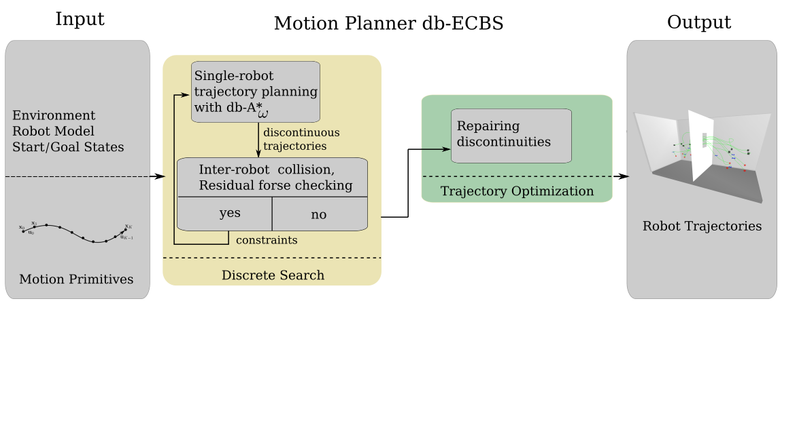

::::
:::{.element: class="fragment current-visible"}

::::
:::{.element: class="fragment current-visible"}
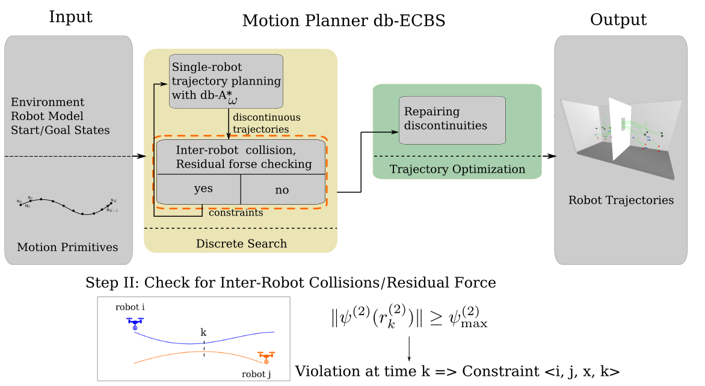
:::: 
:::{.element: class="fragment current-visible"}

::::
:::{.element: class="fragment"}
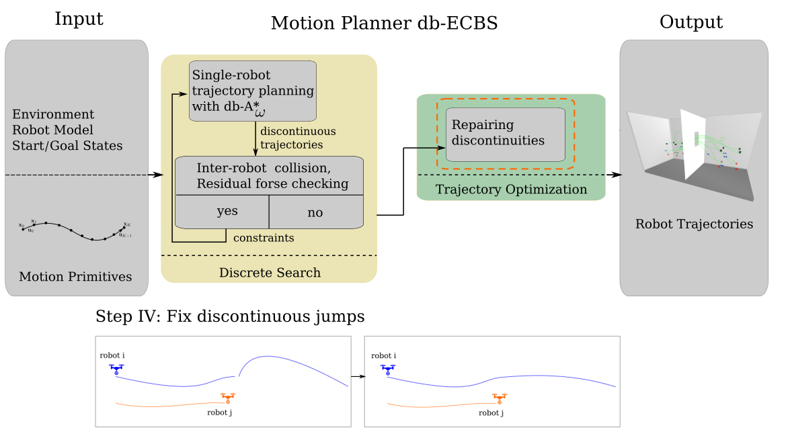
::::
:::

# db-ECBS: Theoretical Properties {#preview}

<div class="empty-box">
As in db-CBS, adding more motion primitives and reducing the discontinuity bound progressively enriches the search space, yielding *asymptotic bounded suboptimality* and *probabilistic completeness*.
</div>


# db-ECBS: Performance Evaluation {#preview}


# db-ECBS: Limitations {#preview}


# Presentation Overview {#preview}

<ul class="overview">
  <li>Introduction, Background</li>
  <li>Kinodynamic Motion Planning for Multi-Robot Systems </li>
</ul>

<div class="three-columns">

<div>
<b>Part I</b><br>
Time-Optimal Motion Planning


</div>

<div>
<b>Part II</b><br>
Interaction Awareness for Motion Planning


</div>

<div>
<b><span style="color:#0072B2;">Part III</span></b><br>
<span style="color:#0072B2;">Safe, Fast Motion Planning</span>


<div style="font-size:0.75em;">
  <strong>(Ch. 7 – ICAPS 2026)</strong><br>

</div>

</div>

</div>

- Conclusion and Future Work

# Part III. Fast, Scalable Multi-Robot Motion Planning {#preview}

# Part III. Contributions {#preview}

# Part III.  Fast, Scalable Multi-Robot Motion Planning {#preview}

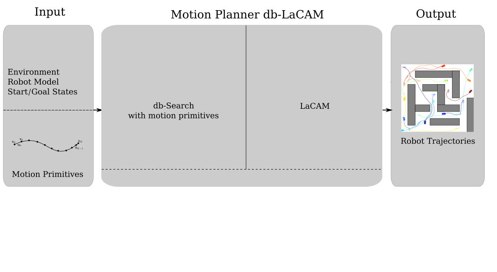
<div style="position:absolute; bottom:20px; left:40px; right:40px; font-size:0.75em; color:gray;">
Moldagalieva, A., Okumura, K., Prorok, A., Hönig, W. (2026) <i> db-lacam: Fast and scalable multi-robot kinodynamic motion planning with discontinuity-bounded search and lightweight MAPF</i>, International Conference on Automated Planning and Scheduling (ICAPS).
</div>


# db-LaCAM: Fast, Scalable Motion Planner {#preview}

::: {.r-stack}

:::{.element: class="fragment current-visible"}
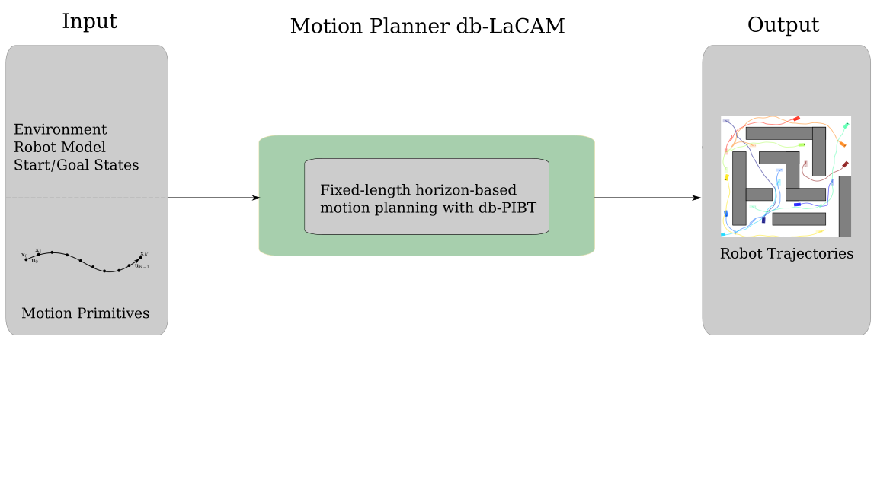
::::
:::{.element: class="fragment current-visible"}
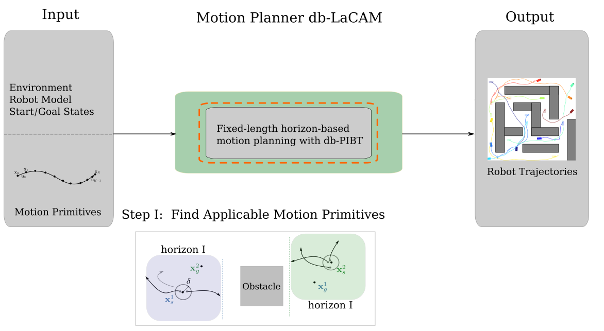
::::
:::{.element: class="fragment current-visible"}

:::: 
:::{.element: class="fragment current-visible"}
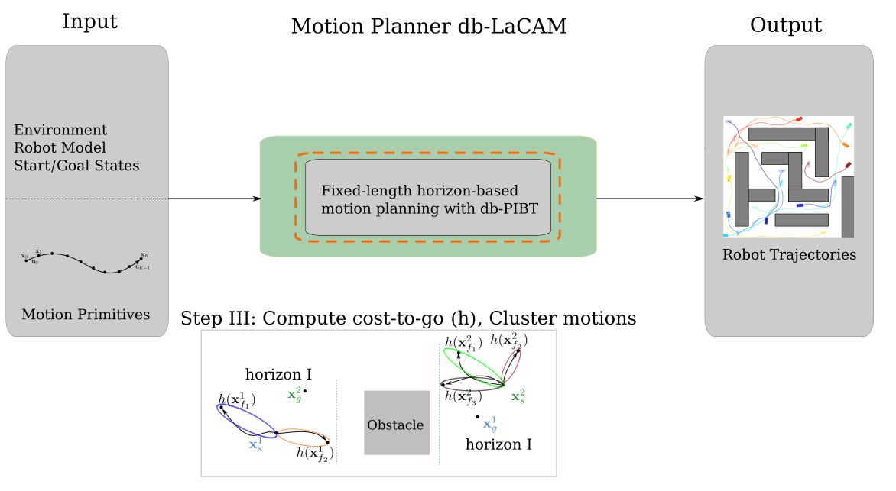
::::
:::{.element: class="fragment current-visible"}
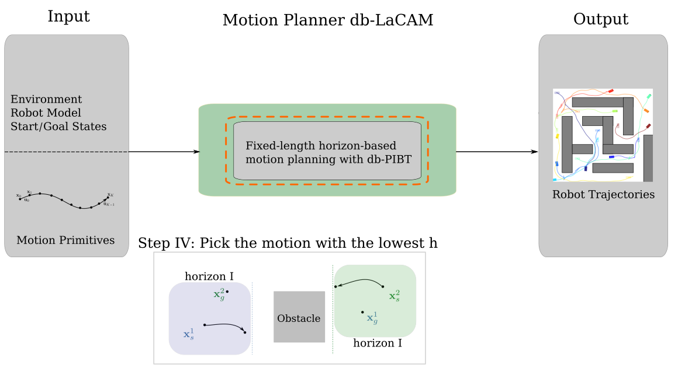
::::
:::{.element: class="fragment current-visible"}
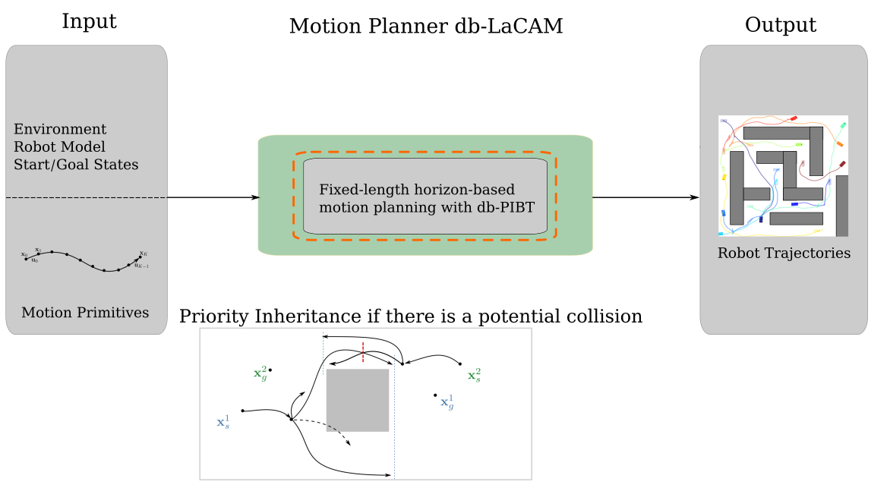
::::
:::{.element: class="fragment"}
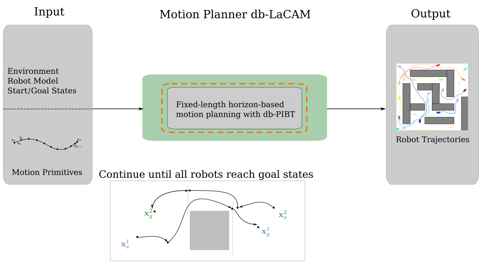
::::
:::

# db-LaCAM: Results {#preview}

# db-LaCAM: Limitations {#preview}

# Conclustion 

# Future Work

# Thanks 

# References