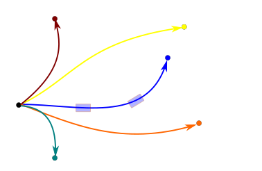
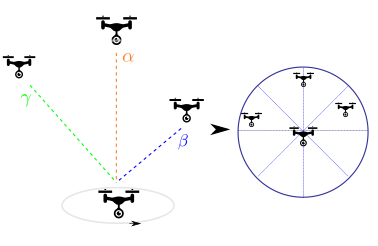
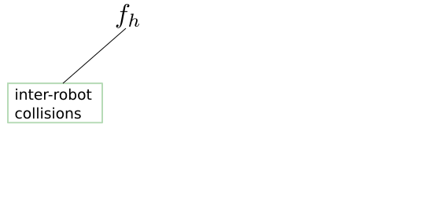
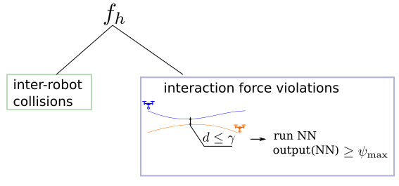
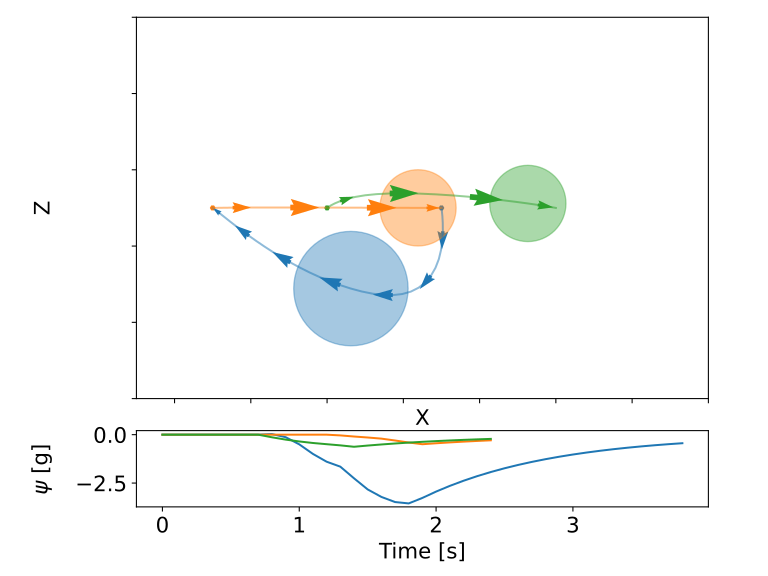
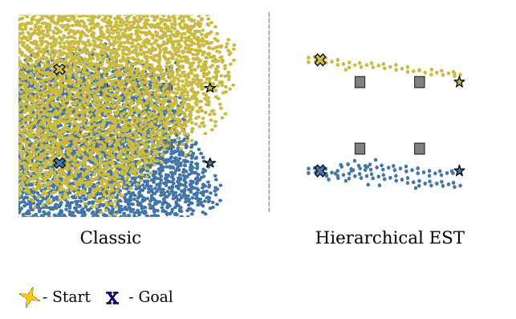
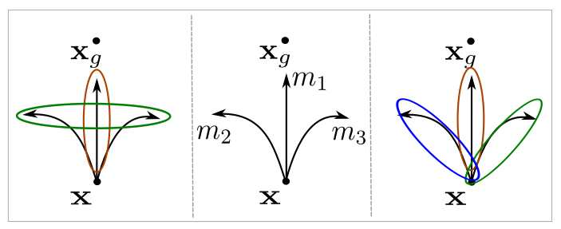
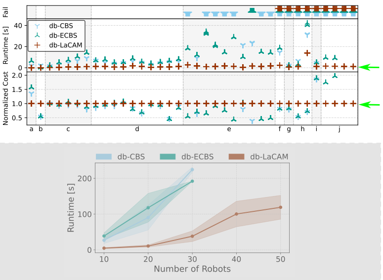
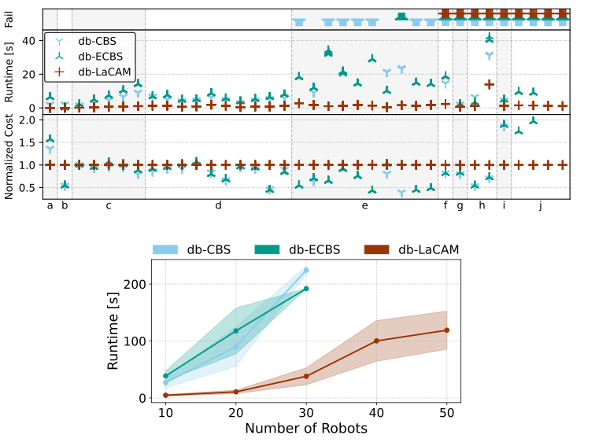

# Autonomous Multi-Robot Systems

Multiple robots can accomplish tasks that are impossible, inefficient, or unsafe for a single robot, enabling *scalable*, *robust*, and *efficient* operation in complex environments.


. . . 

Autonomous multi-robot systems require effective coordination to efficiently achieve their goals while safely managing interactions among robots and with the environment.

# Multi-Robot Coordination {#preview}


# Multi-Robot Coordination {#preview}

::: {.r-stack}
:::{.current-visible data-fragment-index="1"}

::::
:::{.fragment .current-visible data-fragment-index="2"}

:::: 
:::{.fragment .current-visible data-fragment-index="3"}

::::
:::

### Key Challenges in Multi-Robot Coordination

::: {data-fragment-index="1"}
- Time-Optimality: How fast can robots reach their goals?
:::

::: {.fragment  data-fragment-index="2"}
- Interaction-Awareness: How should robots coordinate in close proximity?
:::

::: {.fragment data-fragment-index="3"}
- Scalability & Efficiency: Can motion planning be fast and scalable?
:::

# Dissertation Contributions {#preview}

<div class="three-columns">

<div>
Time-Optimal Motion Planning


</div>

<div>
Interaction Awareness for Motion Planning


</div>

<div>
Safe, Fast Motion Planning


</div>

</div>

. . . 

<div class="three-columns">

<div>
Diffusion Model-based Motions


</div>

<div>
Virtual Omnidirectional Perception


</div>

</div>

# Dissertation Contributions {#preview}


<div class="three-columns">

<div>
Time-Optimal Motion Planning


</div>

<div>
Interaction Awareness for Motion Planning


</div>

<div>
Safe, Fast Motion Planning


</div>

</div>

. . . 

::: {.box-green}
:::: {.box-green-title}
Research Vision
::::
Design a unified, *theoretically grounded* motion planning framework for *heterogeneous* robots that respects each robot’s *kinodynamic* constraints.
:::


# Presentation Overview 

<ul class="overview">
  <li class="active">Introduction, Background</li>
  <li>Kinodynamic Motion Planning for Multi-Robot Systems</li>
</ul>

<div class="three-columns">

<div>
<b>Part I</b><br>
Time-Optimal Motion Planning

</div>

<div>
<b>Part II</b><br>
Interaction Awareness for Motion Planning

</div>

<div>
<b>Part III</b><br>
Safe, Fast Motion Planning

</div>

</div>

- Conclusion and Future Work


# Background: Multi-Robot Kinodynamic Motion Planning {#intro}

<video width="70%" autoplay muted loop playsinline>
  <source src="media/video/phd-defense/mrmp-problem.mp4" type="video/mp4">
</video>

Move each robot from its start state ($\mathbf{s}_1$, $\mathbf{s}_2$) to its goal state ($\mathbf{g}_1$, $\mathbf{g}_2$) while avoiding obstacles and collisions with other robots, and respecting *robot dynamics*.


# Background: Robot Dynamics {#preview}

Dynamics - function that describes the change of the configuration space, given the current configuration and control.

. . .

::: {.box-green}
:::: {.box-green-title}
Car-with-trailer Dynamics
::::
- States: $\mathbf{x} = (x, y, \theta_1, \theta_2)$
- Actions: $\mathbf{u} = (v, \phi)$
- Dynamics: $\mathbf{\dot{x} = \mathbf{f}(\mathbf{x}, \mathbf{u})}$, more precisely:

$\dot{x} = v \cos \theta_1, \quad \dot{y} = v \sin \theta_1, \quad \dot{\theta_1} = \frac{v}{L}\tan \phi$,  $\quad \dot{\theta_2} = \frac{v}{L_h} \sin (\theta_1 - \theta_2)$

:::

{width=400}


# Background: discontinuity-bounded Search with Motion Primitives {#preview}

- Motion primitive - short trajectories, which follows robot dynamics $\mathbf{x}_{k+1} = \mathbf{f}(\mathbf{x}_k,\mathbf{u}_k)$

{width=500}

. . . 

- discontinuity-bounded Search - allows for an user-defined discontinuity ($\delta$) between states

{width=500}


# Presentation Overview

<ul class="overview">
  <li>Introduction, Background</li>
  <li class="active">Kinodynamic Motion Planning for Multi-Robot Systems</li>
</ul>

<div class="three-columns">

<div>
<b>Part I</b><br>
Time-Optimal Motion Planning

</div>

<div>
<b>Part II</b><br>
Interaction Awareness for Motion Planning

</div>

<div>
<b>Part III</b><br>
Safe, Fast Motion Planning

</div>

</div>

- Conclusion and Future Work

# Presentation Overview {#preview}

<ul class="overview">
  <li>Introduction, Background</li>
  <li>Kinodynamic Motion Planning for Multi-Robot Systems </li>
</ul>

<div class="three-columns">

<div>
<b><span style="color:#0072B2;">Part I</span></b><br>
<span style="color:#0072B2;">Time-Optimal Motion Planning</span>


<div style="font-size:0.75em;">
  <strong>(Ch. 4 – ICRA 2024)</strong><br>
  (Ch. 5 – Preprint)
</div>
</div>

<div>
<b>Part II</b><br>
Interaction Awareness for Motion Planning

</div>

<div>
<b>Part III</b><br>
Safe, Fast Motion Planning

</div>

</div>

- Conclusion and Future Work


# Part I. Time-Optimal Kinodynamic Motion Planning for Multi-Robot Systems {#preview}


# Related Work {#intro}

::: {.container}

:::: {.col}
::: {.box-def}
:::: {.box-blue-title}
MAPF
::::
- Optimal graph planning
- Scales to > 1000 agents
- <span style="color:red">Ignores robot dynamics</span>


<div style="font-size:0.6em; color:gray; margin-top:-1.1em;">
Sharon et al., 2015; J. Li, Chen, et al., 2021; Okumura, 2023b; 
</div>

:::
::::

:::: {.col}
::: {.box-def}
:::: {.box-blue-title}
MAPF + Post-processing
::::
- Dynamically feasible
- Smooth trajectories
- <span style="color:red">Suboptimal trajectories</span>


<div style="font-size:0.6em; color:gray; margin-top:-1.1em;">
Hönig et al., 2018; Luis et al., 2020;
</div>
:::
::::

:::: {.col}
::: {.box-def}
:::: {.box-blue-title}
Bezier/Spline-based 
::::
- Scale well
- <span style="color:red">Suboptimal trajectories</span>
- <span style="color:red">Limited dynamics</span> 


<div style="font-size:0.6em; color:gray; margin-top:-1.1em;">
Senbaslar et al., 2023; Yan & Li, 2024;
</div>
:::
::::

:::

. . . 

Research Gap: 


- Kinodynamic feasibility — Respect the dynamics of each robot

. . . 

- Model generality — Support arbitrary robot dynamics

. . .

- Time optimality — Produce time-optimal solutions


# db-CBS: discontinuity-bounded Conflict-based Search for Multi-Robot Kinodynamic Motion Planning {#preview}

. . . 

::: {.box-green}
- Probabilistically complete and asymptotically optimal
- Finds near-optimal solutions quickly
- Supports arbitrary robot dynamics
:::


```{=html}
<video data-autoplay loop muted playsinline src="media/video/phd-defense/dbcbs-intro.mp4" width="90%"></video>
```

<div style="position:absolute; bottom:20px; left:40px; right:40px; font-size:0.75em; color:gray;">
Moldagalieva, A., Ortiz-Haro, J., Toussaint, M., Hönig, W. (2024) <i>db-CBS: discontinuity-bounded Conflict-Based Search for Multi-Robot Kinodynamic Motion Planning</i>, IEEE  International Conference on Robotics and Automation (ICRA).
</div>


# db-CBS: Approach {#preview}

::: {.r-stack}

:::{.element: class="fragment current-visible"}


::::
:::{.element: class="fragment current-visible"}


::::
:::{.element: class="fragment current-visible"}

::::
:::{.element: class="fragment current-visible"}

:::: 
:::{.element: class="fragment"}

::::
:::

# db-CBS: Theoretical Properties {#preview}

<div class="empty-box">
By adding more motion primitives and reducing disconinuity bound, the discrete search space becomes increasingly rich, yielding *asymptotic optimality*. 
Asymptotic optimality implies *probabilistic completeness*.
</div>


# db-CBS: Performance Evaluation {#preview} 

- Example: Random (heterogeneous)
- Dynamics: unicycle ($1^{(st)}$ order), car-with-trailer, double integrator

```{=html}
<video data-autoplay loop muted playsinline src="media/video/nu/dbcbs-scalability.mp4" width="100%"></video>
```


# db-CBS: Performance Evaluation {#preview} 

- Example: Random (heterogeneous)
- Dynamics: unicycle ($1^{(st)}, 2^{(nd)}$ order), car with trailer, double integrator

```{=html}
<video data-autoplay loop muted playsinline src="media/video/phd-defense/only-dbcbs.mp4" width="90%"></video>
```
. . . 


*Take away*: db-CBS achieves $50\text{-}65\%$ lower cost than the second-best planner (K-CBS).

# db-CBS is good, but ... {#preview}

. . . 

- Poor scalability (up to 8 robots) 
- Ignores residual force between robots

. . . 

::: {.box-green}
Part II addresses these limitations.
:::

# Presentation Overview {#preview}

<ul class="overview">
  <li>Introduction, Background</li>
  <li>Kinodynamic Motion Planning for Multi-Robot Systems </li>
</ul>

<div class="three-columns">

<div>
<b>Part I</b><br>
Time-Optimal Motion Planning


</div>

<div>
<b><span style="color:#0072B2;">Part II</span></b><br>
<span style="color:#0072B2;">Interaction Awareness for Motion Planning</span>


<div style="font-size:0.75em;">
  <strong>(Ch. 6 – T-RO 2025)</strong><br>
  (Ch. 7 – MRS 2023)

</div>

</div>

<div>
<b>Part III</b><br>
Safe, Fast Motion Planning


</div>

</div>

- Conclusion and Future Work

# Part II. Interaction Awareness for Motion Planning {#preview}


# Aerodynamic Force between Flying Robots {#preview}

```{=html}
<video data-autoplay loop muted playsinline src="media/video/phd-defense/downwash.mp4" width="100%"></video>
```

. . . 

::::: {.box-red}
Robots can deviate from their planned trajectories, causing the lower robot to crash.
:::::

# Related Work {#preview}

::: {.container}

:::: {.col}
::: {.box-def-two}
:::: {.box-blue-title}
Conservative Planner
::::
- Assumes ellipsoid shape around robots
- Scales well ($\le$ 32 robots)
- <span style="color:red">Fails in tight environments</span>


<div style="font-size:0.6em; color:gray; margin-top:-1.6em;">
Hönig et al., 2018;
</div>
:::
::::

:::: {.col}
::: {.box-def-two}
:::: {.box-blue-title}
Learning-based Planner
::::
- Learns residual dynamics
- Works with heterogeneous robots
- <span style="color:red">Assumes simplified 2D dynamics</span>
- <span style="color:red">Poor scalability ($\le$ 3 robots)</span>


<div style="font-size:0.6em; color:gray; margin-top:0.1em;">
Shi et al., 2022; J. Li et al., 2023 
</div>
:::
::::

:::

. . . 

Research Gap: 

. . .

- Tight-space navigation — Navigate in close proximity without conservative geometric approximations

. . . 

- Scalability — Efficiently coordinate larger teams of robots.


# db-ECBS: Interaction-Aware Multi-Robot Kinodynamic Motion Planning {#preview}

. . . 

::: {.box-green}
- Probabilistically complete and asymptotically bounded suboptimal
- Reasons about interaction force between robots
- Scales up to 16 robots
:::


```{=html}
<video data-autoplay loop muted playsinline src="media/video/phd-defense/dbecbs-intro.mp4" width="80%"></video>
```

<div style="position:absolute; bottom:-60px; left:40px; right:40px; font-size:0.75em; color:gray;">
Moldagalieva, A., Ortiz-Haro, J., Hönig, W. (2025) <i>db-ECBS: Interaction-Aware Multirobot Kinodynamic Motion Planning</i>, IEEE Transactions on Robotics (T-RO).
</div>


# db-ECBS: Approach {#preview}

::: {.r-stack}

:::{.element: class="fragment current-visible"}

::::
:::{.element: class="fragment current-visible"}


::::
:::{.element: class="fragment current-visible"}

::::
:::{.element: class="fragment current-visible"}

:::: 
:::{.element: class="fragment current-visible"}

::::
:::{.element: class="fragment"}

::::
:::

# db-ECBS: Enhancements to db-CBS {#preview}

. . . 

- FOCAL set

$$
F = \{\, n \mid n \in O,\; n.\mathrm{cost} \leq \omega \cdot LB \,\}
$$

. . . 

- Interaction-awareness

  - Robot's state, dynamics change 

    $$
      x_{k+1}
      \approx
      \operatorname{step}\!\left(
      x_k,
      u_k,
      {\color{orange}{\psi\!\left(r_k\right)}}
       \right)\Delta t
    $$

  - Focal heuristic ($f_h$) computation

    ::: {.r-stack}

    :::{.element: class="fragment current-visible"}
    
    ::::

    :::{.element: class="fragment"}
    
    ::::
    :::


# db-ECBS: Performance Evaluation {#preview}

- Example: Swap-three (w/ aerodynamic interaction)

<div style="display: flex; align-items: center; gap: 2%;">

<div style="width: 75%;">

<video data-autoplay loop controls style="width: 100%;">
  <source src="media/video/nu/swap3-drone.mp4" type="video/mp4">
</video>

</div>

<div style="width: 50%;">



</div>

</div>

<span style="color:#e99a24;">Orange</span> - large size robot, <span style="color:blue;">blue</span> - small size robot.

. . . 

- letting the <span style="color:#e99a24;">large</span> robot under <span style="color:blue;">small</span> robots &rarr; lower solution cost


# db-ECBC: Performance Evaluation {#preview}

- Example: Window (w/ aerodynamic interaction)
- Platform: Crazyflie 2.1 robots

```{=html}
<video data-autoplay src="media/video/nu/dbecbs-uav.mp4" width="90%"></video>
```
. . . 

*Take away*:  Ellipsoidal robot shapes cause more frequent collisions in this small environment, increasing conflict-resolution time.

# db-ECBS: Limitations

. . . 

- Computationally expensive
- Optimization complexity, sometimes fails to converge

. . . 

::: {.box-green}
Part III mitigates these limitations.
:::

# Presentation Overview {#preview}

<ul class="overview">
  <li>Introduction, Background</li>
  <li>Kinodynamic Motion Planning for Multi-Robot Systems </li>
</ul>

<div class="three-columns">

<div>
<b>Part I</b><br>
Time-Optimal Motion Planning


</div>

<div>
<b>Part II</b><br>
Interaction Awareness for Motion Planning


</div>

<div>
<b><span style="color:#0072B2;">Part III</span></b><br>
<span style="color:#0072B2;">Safe, Fast Motion Planning</span>


<div style="font-size:0.75em;">
  <strong>(Ch. 7 – ICAPS 2026)</strong><br>
</div>

</div>

</div>

- Conclusion and Future Work

# Part III. Fast, Scalable Multi-Robot Motion Planning {#preview}

# Computational Effort in db-ECBS Motion Planner {#preview}


\begin{equation}
  \mathcal{O}\left(K\left(\sum_{i=1}^{N} \max\left(d_x^{(i)},d_u^{(i)}\right)\right)^3\right)
\end{equation}

$d^{(i)}_x, d^{(i)}_u$ - state and action dimensions of robot $i$, 
$N$ - number of robots, 
$K = \max_{i \in N} K^{(i)}$, $K^{(i)}$ - number of time steps in the discrete search solution of the $i^{\text{th}}$ robot.

<!-- . . . 

::::: {.box-red}
With the increasing number of robots, the computational burden increases.
::::: -->

# db-LaCAM: Fast and scalable multi-robot kinodynamic motion planning with discontinuity-bounded search and lightweight MAPF {#preview}

. . . 

::: {.box-green}
- Scalability up to 50 robots
- Computational runtime up to 10x faster
:::


```{=html}
<video data-autoplay loop muted playsinline src="media/video/icaps/icaps-gif.mp4" width="70%"></video>
```

<div style="position:absolute; bottom:-100px; left:-20px; right:40px; font-size:0.75em; color:gray;">
Moldagalieva, A., Okumura, K., Prorok, A., Hönig, W. (2026) <i> db-LaCAM: Fast and scalable multi-robot kinodynamic motion planning with discontinuity-bounded search and lightweight MAPF</i>, International Conference on Automated Planning and Scheduling (ICAPS).
</div>


# db-LaCAM: Approach {#preview}

::: {.r-stack}

:::{.element: class="fragment current-visible"}

::::
:::{.element: class="fragment current-visible"}

::::
:::{.element: class="fragment current-visible"}

::::
:::{.element: class="fragment current-visible"}

:::: 
:::{.element: class="fragment current-visible"}

::::
:::{.element: class="fragment current-visible"}

::::
:::{.element: class="fragment current-visible"}

::::
:::{.element: class="fragment"}

::::
:::

# db-LaCAM: Why Efficient? {#preview}

. . . 

- db-PIBT 

. . . 

- h-value estimation with Hierachical EST 



. . . 

- Motion clustering methods



# db-LaCAM: Theoretical Properties {#preview}

<div class="empty-box">
db-LaCAM is *probabilistically complete* up to the resolution of its motion-primitive graph. 
<!-- Exhaustive search eventually finds a solution, while stochastic motion sampling gives a non-zero probability of selecting the required motions. -->
</div>

# db-LaCAM: Performance Evaluation {#preview}

::: {.r-stack}

:::{.element: class="fragment current-visible"}
<!--  -->

::::
:::{.element: class="fragment"}
<!--  -->

::::

:::

. . . 

*Take away*: db-LaCAM is up to $10\times$ faster than db-CBS and db-ECBS and scales better with team size. 

# db-LaCAM: Performance Evaluation {#preview}

Platforms: 10 Sanity drones, 4 Polulu robots with attached trailers.

```{=html}
<video data-autoplay loop muted playsinline src="media/video/nu/dblacam.mp4" width="100%"></video>
```

# db-LaCAM: Performance Evaluation {#preview}

- Example: Random with 50 robots
- Dynamics: unicycle ($1^{(st)}$ order)

```{=html}
<video data-autoplay loop muted playsinline src="media/video/phd-defense/n50_faster.mp4" width="60%"></video>
```
# db-LaCAM: Limitations {#preview}


- Struggles with instances with narrow passes

```{=html}
<video data-autoplay loop muted playsinline src="media/video/phd-defense/livelock-dblacam.mp4" width="100%"></video>
```


# Conclusion

# Conclusion: Impact of Research Results

::: {.box-green}
:::: {.box-green-title}
Physically realistic planning &rarr; Real-world deployment
::::
- Plan motions that respect what robots can actually execute
- Move beyond simplified models to heterogeneous robot dynamics
- Bring multi-robot planning closer to real-world autonomous operation
:::


# Conclusion: Summary of Contributions {#preview}

<ul class="overview">
  <li>Kinodynamic Motion Planning for Multi-Robot Systems </li>
</ul>

<div class="three-columns">

<div class="part-column">
<b>Part I</b><br>
Time-Optimal Motion Planning
</div>


<div class="part-column">
<b>Part II</b><br>
Interaction Awareness for Motion Planning
</div>


<div class="part-column">
<b>Part III</b><br>
Safe, Fast Motion Planning
</div>

</div>

. . . 


<div class="parts-result-boxes">

  <div class="result-box">
  - high-quality solutions
  - heterogeneous robot dynamics
  <br>
  <span style="color: #0072B2; position: relative; top: 165px; left: 5px;">
    (Ch. 4 - ICRA 2024)<br>
    (Ch. 5 - Preprint)
  </span>
  </div>

  <div class="result-box">
  - safe trajectories in dense formations
  - scalability up to 16 robots
  <br>
  <span style="color: #0072B2; position: relative; top: 160px; left: 5px;">
    (Ch. 6 - T-RO 2025)<br>
    (Ch. 7 - MRS 2023)
  </span>
  </div>

  <div class="result-box">
  - computational runtime improvement up to $10\times$
  - scalability up to 50 robots
  <br>
  <span style="color: #0072B2; position: relative; top: 160px; left: 5px;">
    (Ch. 8 - ICAPS 2026)
  </span>
  </div>

</div>


# Conclusion: Limitations {#preview}

<ul class="overview">
  <li>Kinodynamic Motion Planning for Multi-Robot Systems </li>
</ul>

<div class="three-columns">

<div class="part-column">
<b>Part I</b><br>
Time-Optimal Motion Planning
</div>


<div class="part-column">
<b>Part II</b><br>
Interaction Awareness for Motion Planning
</div>


<div class="part-column">
<b>Part III</b><br>
Safe, Fast Motion Planning
</div>

</div>

. . . 

<div class="parts-result-boxes">

  <div class="result-red-box">
  - In obstacle-dense environments, the planner can spend significant time resolving conflicts.
  </div>

  <div class="result-red-box">
  - The joint-state space trajectory optimization scales poorly with large robot teams.
  </div>

  <div class="result-red-box">
  - With non-accurate heuristic estimation, the planner can be inefficient.
  - Livelock scenes have poor quality solutions
  </div>

</div>


# Open Challenges and Future Work {#preview}

. . .

- Motion planning for unmodeled dynamics
  </span>

. . .

- Task and Motion Planning Integration/System-level Intelligence 

<!-- Internal decision-making mechanisms that allocate tasks based on individual capabilities and global objectives. -->

. . . 

- Real-Time performance and guarantees 
<!-- - Balancing formal guarantees with real-time computational performance. -->

. . . 

- Benchmarking and Standardization 
<!-- Reproducibility and fair comparison between different methods. -->


# Thanks to {#preview}

all my collaborators and co-authors!<br>

. . . 

<div style="text-align: left;">
<span style="color: black;"><b>Intelligent Multi-Robot Coordination, Learning and Intelligent System groups at TU Berlin</b></span><br>
Wolfgang Hönig, Marc Toussaint, Ilaria Cicchetti-Nilsson, Thalia Prokopiou, Jana Peich, Quim Ortiz-Haro, Khaled Wahba, Pia Hanfeld, Svetlana Levit, Christoph Scherer, Omar Elsayed, Valentin Hartmann, Danny Driess, Ingmar Schubert,
Jung-Su Ha, Welf Rehberg, Dennis Schmidt, Denis Scherba, Eckart Cobo Briesewitz, Hongyou
Zhou, Cornelius Braun, Shiping Ma, Sayantan Auddy, Nan Cai, Pablo Robles Cervantes, Julien
Thévenoz, Jan Achermann, Leon Thormeyer, Jiaming Li, Johannes Roser, Viktor Lorentz, Keerthana Laxmish, Jana Schicke, Charlotte Stentzler, Julius Franke, Max Klemens.
<br>
<div>

<div style="text-align: left;">
<span style="color: black;"><b>External </b></span> Keisuke Okumura, Amanda Prorok, Prorok Lab at the University of Cambridge.
<div>

. . . 

<div style="text-align: left; margin-top: 1.5cm">
Family and Friends
</div>

. . . 

<div style="text-align: left; margin-top: 1.5cm">
Committee:
</div>
<div style="text-align: left;">
Prof. Dr. Nora Ayanian, Prof. Dr. Sven Koenig, Prof. Dr. Wolfgang Hönig, Prof. Dr. Marc Toussaint
</div>

. . . 

<div style="text-align: left; margin-top: 1.5cm">
Thanks for your attention!
</div>

# References I {#preview}
<div style="text-align: left;">
Sharon, G., Stern, R., Felner, A., & Sturtevant, N. R. (2015). Conflict-based search for optimal
multi-agent pathfinding. Artificial Intelligence (AIJ)<br>
Li, J., Chen, Z., Harabor, D., Stuckey, P. J., & Koenig, S. (2021). Anytime multi-agent path
finding via large neighborhood search. International Joint Conference on Artificial In-
telligence (IJCAI)<br>
Okumura, K. (2023). Lacam: Search-based algorithm for quick multi-agent pathfinding. Conference on Artificial Intelligence (AAAI)<br>
Hönig, W., Preiss, J. A., Kumar, T. K. S., Sukhatme, G. S., & Ayanian, N. (2018). Trajectory
planning for quadrotor swarms. IEEE Transactions on Robotics (T-RO)<br>
Luis, C. E., Vukosavljev, M., & Schoellig, A. P. (2020). Online trajectory generation with dis-
tributed model predictive control for multi-robot motion planning. IEEE Robotics and
Automation Letters (RA-L)<br>
Senbaslar, B., Hönig, W., & Ayanian, N. (2023). RLSS: real-time, decentralized, cooperative, net-
workless multi-robot trajectory planning using linear spatial separations. Autonomous
Robots<br> 
Yan, J., & Li, J. (2024). Multi-agent motion planning with bézier curve optimization under
kinodynamic constraints. IEEE Robotics and Automation Letters (RA-L)<br>
Hönig, W., Preiss, J. A., Kumar, T. K. S., Sukhatme, G. S., & Ayanian, N. (2018). Trajectory
planning for quadrotor swarms. IEEE Transactions on Robotics (T-RO)<br>
Shi, G., Hönig, W., Shi, X., Yue, Y., & Chung, S.-J. (2022). Neural-swarm2: Planning and control
of heterogeneous multirotor swarms using learned interactions. IEEE Transactions on
Robotics (T-RO)<br>
Li, J., Han, L., Yu, H., Lin, Y., Li, Q., & Ren, Z. (2023). Nonlinear mpc for quadrotors in close-
proximity flight with neural network downwash prediction. IEEE Conference on Deci-
sion and Control (CDC)
<div>


# Image References
<div style="text-align: left;">
[1] Long-Horizon Multi-Robot Rearrangement Planning for Construction Assembly, Valentin N.
Hartmann, Andreas Orthey, Danny Driess, Ozgur S. Oguz, Marc Toussaint. IEEE T-RO 2022<br>
[2] Control of over-redundant cooperative manipulation via sampled communication, Enrica Rossi, Marco Tognon, Ruggero Carli, Antonio Franchi, Luca Schenato. Pre-print 2021<br>
[3] https://www.independent.co.uk/news/business/robots-amazon-delivery-artificial-intelligence-technology-a9264036.html<br>
[4] https://www.market-prospects.com/articles/ai-robots-disrupt-the-manufacturing-industry
<div>

# Additional Material

# Virtual Omnidirectional Perception {#preview}

```{=html}
<video data-autoplay loop muted playsinline src="media/video/phd-defense/rotating-camera.mp4" width="50%"></video>
```

. . . 

- Wall inspection
- Landing for charging
- Object transportation


# db-ECBS with Omnidirectional Vision {#preview}vs.

- Outdoor deployment
- No localization (except for starting state)
- Offline motion planning &rarr; Execution stage

. . . 


# db-ECBS with Omnidirectional Vision {#preview}


::: {.r-stack}

:::{.element: class="fragment current-visible"}


::::
:::{.element: class="fragment current-visible"}


:::: 
:::{.element: class="fragment"}

::::
:::


# Hyperparameters for db-ECBS motion planner {#preview}


Large $\delta$ - needs few motion primitives &rarr; lower computation time <br>

Smaller $\delta$ - requires more motion primitives &rarr; higher computation time.


# discontinuity-bound value vs. Number of Motion Primitives {#preview}


# Trajectory Optimization {#preview}


# Trajectory Optimization Complexity {#preview}

\begin{equation}
  \mathcal{O}\left(K\left(\sum_{i=1}^{N} \max\left(d_x^{(i)},d_u^{(i)}\right)\right)^3\right),
\end{equation}

$d^{(i)}_x, d^{(i)}_u$ - state and action dimensions of robot $i$, 
$N$ - number of robots, 
$K = \max_{i \in N} K^{(i)}$, $K^{(i)}$ - number of time steps in the discrete search solution of the $i^{\text{th}}$ robot.


# Trajectory Optimization Failure {#preview}

. . . 

- Slow convergence due to the high number of decision variables &rarr; exceeds the time limit. <br>
<span style="color: green;">Solution: meta-optimization</span>

. . . 

- Poor discrete solution &rarr; collision violations. <br>
<span style="color: green;">Solution: provide *better* set of motion primitives</span>


# db-LaCAM: Livelock Handling {#preview}

Space-Cover and Goal-Oriented Clustering improved the solution quality

```{=html}
<video data-autoplay loop muted playsinline src="media/video/phd-defense/livelock-behaviour.mp4" width="80%"></video>
```
. . . 

Assumptions: 

- Accurate *h-value* estimation
- Given finite search space and expressive motion primitives


# db-LaCAM: Livelock Handling {#preview}

Tight environments can cause livelocks

```{=html}
<video data-autoplay loop muted playsinline src="media/video/phd-defense/livelock-dblacam.mp4" width="100%"></video>
```
. . . 

<span style="color: green;">Solution: better heuristics, that could predict livelong settings and avoid it (GNN-based, f.i)</span>

# db-ECBS Node Expansion {#preview}


# db-CBS vs. db-ECBS with $\omega=1$

::: {.container}

:::: {.col}
::: {.box-def-two}
:::: {.box-blue-title}
db-CBS
::::

- f = g (cost-to-come) + h (<span style="color: green;">cost-to-go</span> )
- Discrete search runtime is 50.8 s (average)


:::
::::

:::: {.col}
::: {.box-def-two}
:::: {.box-blue-title}
db-ECBS
::::

- f = g (cost-to-come) + h (<span style="color: green;">collisions</span> )
-  Discrete search runtime is 5.9 s (average)


:::
::::

:::

Even though FOCAL = OPEN for db-ECBS


# db-CBS with Interaction Awareness

. . . 


- Change dynamics (as in db-ECBS)

$\dot{\mathbf{x}}^{(i)} = \mathbf{f}^{(i)}(\mathbf{x}^{(i)}, \mathbf{u}^{(i)})$  &rarr;  $\dot{\mathbf{x}}^{(i)} = \mathbf{f}^{(i)}(\mathbf{x}^{(i)}, \mathbf{u}^{(i)}, \mathbf{\psi}^{(i)}(\mathbf{r}^{(i)}))$, <br>
$\mathbf{\psi}^{(i)}(\cdot)$ - additional disturbance force.

. . .

- Create constraints from <span style="color: orange;">inter-robot interactions</span>, beyond inter-robot collisions


# db-PIBT with Interaction Awareness

. . . 

- No need to alter the robot's state

- While rolling out motions, check each state for <span style="color: orange;">inter-robot interactions</span>, beyond collisions 


# Fixing the discontinuity {#preview}

::: {.container}

:::: {.col}
::: {.box-def-two-wide}
:::: {.box-blue-title}
w/ Rollout
::::
- 3D environment + <span style="color: red">narrow pass</span>
- High-dimensional dynamics - <span style="color: red">Lipschitz continuity</span> breaks
- <span style="color: red">Expensive search</span> with car-with-trailer

::: {.r-stack}
:::{.element: class="fragment current-visible"}

::::
:::{.element: class="fragment current-visible"}

::::


:::

:::
::::


:::: {.col}
::: {.box-def-two-wide}
:::: {.box-blue-title}
w/ Optimization
::::
- <span style="color: red">Narrow pass</span> - collision violations
- <span style="color: red">Large environment</span>

:::{.element: class="fragment current-visible"}

::::

:::
::::

:::


# Termination Guarantee for db-CBS/ECBS {#preview}

- Compute an upper-bound of the cost (w/ complete, suboptimal polynomial alg.)


- OPEN set keeps nodes with cost < upper bound cost, this makes sure that the OPEN set gets empty.


# Benchmarking Problem Instances {#preview}


# Benchmarking Problem Instances {#preview}

::: {.container}

:::: {.col}
::: {.box-def-two}
:::: {.box-blue-title}
Environment Properties
::::
- Dimensions — width × height × height (2D/3D)
- Obstacle geometry — boxes, arbitrary meshes
- Obstacle size — dimensions/radius
- Obstacle placement — positions
- Narrow passages — minimum corridor/window width
:::
::::

:::: {.col}
::: {.box-def-two}
:::: {.box-blue-title}
Robot Properties
::::
- Number of robots
- Robot geometry — sphere, ellipsoid, box, etc.
- Robot size — radius / dimensions
- Robot state dimension
- Robot control dimension
- Robot state, action limits
- Dynamics model — integrator, unicycle, car-with-trailer, etc.
- Heterogeneity — whether robots have different dynamics, sizes
- Initial and goal states
:::
::::

:::
