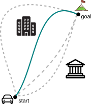
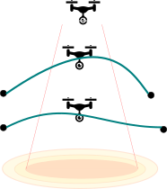
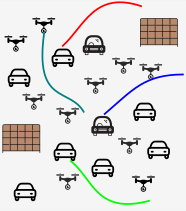
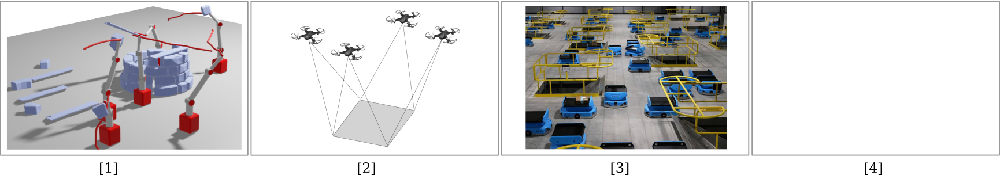
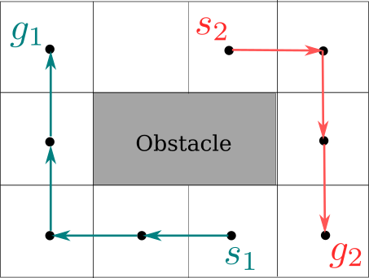
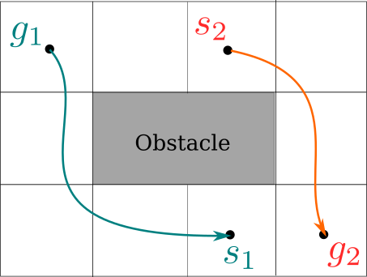

# Presentation Overview

<ul class="overview">
  <li>Introduction: Multi-Robot Coordination</li>
  <li>Kinodynamic Motion Planning for Multi-Robot Systems</li>
</ul>

<b>Part I</b> 
Time-Optimal Motion Planning

<b>Part I</b> 
Interaction Awareness for Motion Planning

<b>Part I</b> 
Safe, Fast Motion Planning

- Conclusion and Future Work

# Presentation Overview

<ul class="overview">
  <li class="active">Introduction: Multi-Robot Coordination</li>
  <li>Kinodynamic Motion Planning for Multi-Robot Systems</li>
</ul>

<b>Part I</b> 
Time-Optimal Motion Planning

<b>Part I</b> 
Interaction Awareness for Motion Planning

<b>Part I</b> 
Safe, Fast Motion Planning

- Conclusion and Future Work

# Autonomous Multi-Robot Systems

Multiple robots can accomplish tasks that are impossible, inefficient, or unsafe for a single robot, enabling *scalable*, *robust*, and *efficient* operation in complex environments.

. . . 

Autonomy of a team of robots requires being able to reach the goal quickly while avoiding collisions with obstacles and other robots.

# Multi-Robot Motion Planning {#intro}

<video width="70%" autoplay muted loop playsinline>
  <source src="media/video/phd-defense/mrmp-problem.mp4" type="video/mp4">
</video>

**Goal**: Move each robot from its start state ($\mathbf{s}_1$, $\mathbf{s}_2$) to its goal state ($\mathbf{g}_1$, $\mathbf{g}_2$) while avoiding obstacles and collisions with other robots.

# Multi-Robot Coordination: Related Work {#intro}

::: {.container}

:::: {.col}
::: {.box-def}
:::: {.box-blue-title}
MAPF
::::
- Optimal graph planning
- Scales to > 1000 agents
- Ignores robot dynamics

Sharon et al., 2015; Sharon et al., 2015; Sharon et al., 2015; 

:::
::::

:::: {.col}
::: {.box-def}
:::: {.box-blue-title}
MAPF + Post-processing
::::
- Dynamically feasible
- Smooth trajectories
- Suboptimal trajectories

Sharon et al., 2015; Sharon et al., 2015; Sharon et al., 2015; 

:::
::::

:::: {.col}
::: {.box-def}
:::: {.box-blue-title}
Differential Flatness 
::::
- Scale well
- Actuation limits ignored
- Limited dynamics 

Sharon et al., 2015; Sharon et al., 2015; Sharon et al., 2015; 

:::
::::

:::

# Research Statement

::: {.box-green}
:::: {.box-green-title}

::::
Design a unified, theoretically grounded motion planning framework for heterogeneous robots that respects each robot’s kinodynamic constraints.
:::

# Presentation Overview

<ul class="overview">
  <li>Introduction: Multi-Robot Coordination</li>
  <li class="active">Kinodynamic Motion Planning for Multi-Robot Systems </li>
</ul>

<b>Part I</b> 
Time-Optimal Motion Planning

<b>Part I</b> 
Interaction Awareness for Motion Planning

<b>Part I</b> 
Safe, Fast Motion Planning

- Conclusion and Future Work